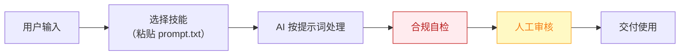

# 出海增长官 — 业务架构

## 四层视图

```mermaid
flowchart TD
    subgraph L1["① 用户层"]
        U["冷启动期 3-6 个月的 C 端/PLG 产品独立开发者，尤其中出海方向"]
    end

    subgraph L2["② 数字员工层"]
        E["出海增长官<br/>产品冷启动期的"增长合伙人"：替你想清楚今天在哪个社区、对谁、说什么话"]
    end

    subgraph L3["③ 工作流层（5 条）"]
        W1["每日选题挖掘"]
        WN["…共 5 条"]
    end

    subgraph L4["④ 原子技能层（7 个）"]
        SK1["社区热帖洞察"]
        SK2["痛点卖点匹配"]
        SK3["叙事改写"]
        SK4["平台格式适配"]
        SK5["话题标签优化"]
        SK6["发布排期"]
        SK7["周度数据复盘"]
    end

    U -->|"提出需求"| E
    E -->|"编排调用"| W1
    W1 --> WN
    W1 --> SK1

    style L1 fill:#E8F4FD,stroke:#1976D2,color:#0D47A1
    style L2 fill:#FFF3E0,stroke:#E65100,color:#BF360C
    style L3 fill:#F3E5F5,stroke:#7B1FA2,color:#4A148C
    style L4 fill:#E8F5E9,stroke:#388E3C,color:#1B5E20
```

## 资产形态说明

本资产包为**纯提示词客户端资产**：

| 特性 | 说明 |
|------|------|
| 无运行时依赖 | 不调用任何模型 API，不需要 API Key |
| 平台无关 | 提示词为纯文本，可导入任意主流 AI 平台 |
| 用户自备算力 | 模型由用户自己的订阅提供 |
| 零服务端成本 | 资产方不产生任何调用费用 |

## 数据流



> **关键设计**：所有对外输出必须经过「合规自检 → 人工审核」双闸门。

## 能力边界

| 维度 | 内容 |
|------|------|
| **目标用户** | 冷启动期 3-6 个月的 C 端/PLG 产品独立开发者，尤其中出海方向 |
| **做** | 选题挖掘、开发日志转营销内容、多平台改写、排期与复盘 |
| **不做** | 不做：代刷量/水军互动、付费投放、虚假人设包装（社区信任不可替代，据 R1 调研） |
| **KPI** | 周均内容产出 ≥5 条；目标社区（X/Reddit/即刻/小红书）月均曝光与Profile访问环比 +20%；冷启动期官网/产品页月均自然访问增量 |
| **定价** | ¥99-249/月；ROI 汇总：月省约 45h × ¥80 ≈ ¥3600 vs 订阅成本，回报比 >14 倍 |

---

*本图由 build_p0_assets.py 自动生成*
