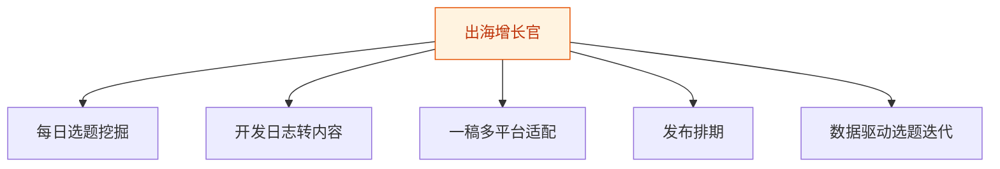
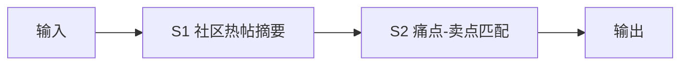
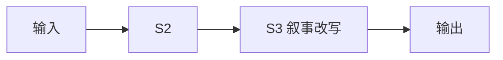
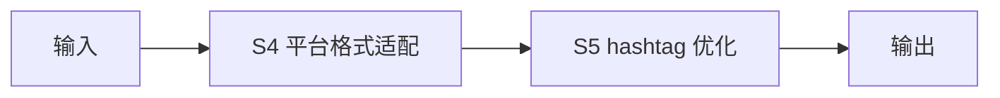
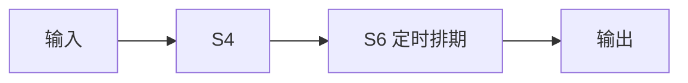
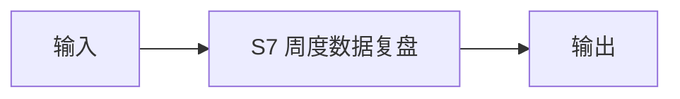

# 出海增长官 — 工作流流程图

本员工共 **5 条工作流**，下辖 **7 个原子技能**。

## 总览

## 分条详情

### 每日选题挖掘

| 项目 | 内容 |
|------|------|
| 触发 | 定时（每日 8:00） |
| 复杂度 | `M` |
| 阶段 | `P0` |
| ROI | 省 0.5h/日 × 30 × ¥80 ≈ ¥1200/月 |

### 开发日志转内容

| 项目 | 内容 |
|------|------|
| 触发 | 人工（提交 commit 摘要/日志） |
| 复杂度 | `S` |
| 阶段 | `P0` |
| ROI | 省 0.8h/日 ≈ ¥1900/月 |

### 一稿多平台适配

| 项目 | 内容 |
|------|------|
| 触发 | 事件（主稿确认后） |
| 复杂度 | `S` |
| 阶段 | `P0` |
| ROI | 省 0.5h/日 ≈ ¥1200/月 |

### 发布排期

| 项目 | 内容 |
|------|------|
| 触发 | 定时 |
| 复杂度 | `M` |
| 阶段 | `P1` |
| ROI | 省 0.2h/日 ≈ ¥480/月 |

### 数据驱动选题迭代

| 项目 | 内容 |
|------|------|
| 触发 | 定时（每周） |
| 复杂度 | `M` |
| 阶段 | `P1` |
| ROI | 决策提质，间接 ROI |

## 汇总表

| # | 工作流 | 阶段 | 复杂度 | 触发 | 涉及技能数 |
|---|--------|------|--------|------|-----------|
| 1 | 每日选题挖掘 | `P0` | `M` | 定时（每日 8:00） | 2 |
| 2 | 开发日志转内容 | `P0` | `S` | 人工（提交 commit 摘要/日志） | 2 |
| 3 | 一稿多平台适配 | `P0` | `S` | 事件（主稿确认后） | 2 |
| 4 | 发布排期 | `P1` | `M` | 定时 | 2 |
| 5 | 数据驱动选题迭代 | `P1` | `M` | 定时（每周） | 1 |

---

*本图由 build_p0_assets.py 自动生成*
