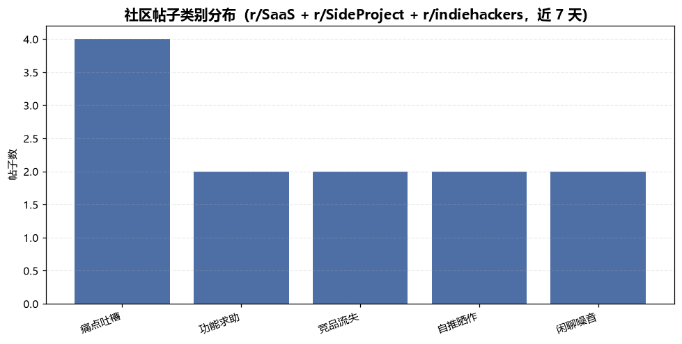

# 社区热帖洞察 Community Post Insight

> 原子技能 ｜ 属于「出海增长官」 ｜ 冷启动期独立开发者（OPC）客群 ｜ T1 产物型（脚本交付真实文件）
>
> **把 Reddit 等开发者社区的热帖变成两张清单：今天回哪些帖（9:1 额度核算）、今天写什么选题（≥3 帖证据链）。**
> 4 类判定词表 + 热度分公式（点赞+2×评论数，24/72h 加权）+ 9:1 参与比核算 + 7 主题聚类 · 一次扫描输出 Excel 洞察清单与类别分布图


🎬 **[▶ 观看演示视频](docs/assets/demo.mp4)** — 四幕数据叙事：业务钩子 → 真实执行 → 指标条形图生长 → 交付物

*上图来自真实执行：12 帖样本四分类为痛点 4 / 求助 2 / 竞品流失 2 / 自推 2 / 噪音 2，判定可参与 6 帖，9:1 额度结论「今日 1 条自推需先完成 ≥9 条非自推参与」，产物落盘 Excel + PNG + JSON。*

---

## 它做什么（四类判定 → 热度分级 → 参与决策）

### 一、四类判定（规则树按顺序短路）

| 顺序 | 类别 | 命中词表（摘录） | 处理 |
|---|---|---|---|
| 1 | 自推晒作 | I built / just shipped / launched / roast my / feedback wanted | 非目标帖，除非发布在允许自推的 sub |
| 2 | 痛点吐槽 | struggle / stuck / hate / frustrating / churn / 踩坑 / 折腾 | **最高价值目标帖**：楼主公开表达未被满足的需求 |
| 3 | 功能求助 | is there a tool / would pay / looking for / alternative to / 愿意付费 | 商业信号更强——「would pay」是付费意愿明示 |
| 4 | 竞品流失 | switched from / just cancelled / moved away from / 太贵 / 弃用 | 记录流失原因，不参与、不攻击竞品 |
| 5 | （都不是） | 闲聊噪音 | 不消耗 9:1 参与配额 |

### 二、热度分级（量化标准）

| 规则 | 取值 |
|---|---|
| 热度分 | 点赞 + 2×评论数，按新鲜度加权：≤24h ×1.2、≤72h ×1.0、更早 ×0.8 |
| 🔥 热 | ≥200（24 小时内参与收益最高） |
| 🌤 温 | 50–200 |
| ❄ 冷 | <50 |
| 讨论型 | 评论/点赞比 > 0.3（参与者是真实活跃用户，参与价值更高） |
| 时效红线 | 帖龄 > 72h 的痛点帖不再跟帖（新帖淹没旧帖），只转入选题库 |

### 三、9:1 参与额度 + 主题聚类

- **9:1 参与比**：自推:非自推 ≈ 1:9；脚本按帖子池核算额度，人工核对账号历史
- **Sub 差异**：r/SideProject 允许自推；r/SaaS 须先参与讨论建立足迹；多数 sub 禁直接广告
- **主题聚类**：定价 / 上手门槛 / 集成导出 / 性能 / 隐私安全 / 移动端 / 协作 七主题归堆，**同主题 7 天窗口 ≥3 帖才入选题候选**（单帖不成选题）

## 真实输入 → 真实输出

**输入**（`examples/input.json`）：12 条真实形态的帖子（id / subreddit / title / ups / num_comments / age_hours），来源 r/SaaS + r/SideProject + r/indiehackers，窗口 7 天。

**输出**（脚本实跑，节选，完整见 [`examples/output.md`](examples/output.md)）：

| # | 类别 | 帖子（标题截断） | 热度分 | 热度档 | 参与建议 |
|---|---|---|---|---|---|
| 1 | 痛点吐槽 | Struggling with churn - users sign up, never come back after day 3… | 454.8 | 🔥 热 · 讨论型 | 以「同行+同样遇到」口吻参与，本条不贴链接 |
| 2 | 功能求助 | Pricing my first SaaS at $9/mo feels wrong - how do you decide pricing? | 463.2 | 🔥 热 · 讨论型 | 给真实定价思路，不贴链接 |
| 3 | 功能求助 | Is there a tool that turns Stripe invoices into a simple monthly P&L? Would pay… | 258.0 | 🔥 热 · 讨论型 | 提及产品必须披露开发者身份 |
| 6 | 竞品流失 | Just cancelled my Calendly subscription, moved away from seat-based pricing tools | 129.0 | 🌤 温 · 讨论型 | 记录流失原因进竞品档案，不参与不攻击 |

**实跑产物**：



- `out/热帖洞察清单.xlsx`（洞察明细 · 热门标红 / 参与决策 / 汇总 三个 sheet）
- `out/帖子类别分布.png`（四类别占比柱状图，上图）
- `out/insight.json`（机器可读结果，供下游工作流读取）

## 处理流水线


## 快速开始

**方式一：提示词（任意 AI 工具）**

```text
1. 打开 prompt.txt，全文复制
2. 粘贴到 Coze / WorkBuddy / Dify / Claude / ChatGPT
3. 按 schema.json 的输入规格提供：source + posts（帖子列表，来自 Reddit 官方 API 或人工粘贴）
```

**方式二：脚本（零 AI 依赖，确定性扫描）**

```bash
# 演示模式（内置真实样例）
python scripts/insight_scan.py --demo
# 指定输入
python scripts/insight_scan.py --input examples/input.json --outdir out
```

依赖：`pip install openpyxl`（缺失时脚本会打印修复命令，不静默失败）。

## 面向谁 / 什么时候用

| ✅ 该用 | ❌ 别用 |
|---|---|
| 冷启动期每天选帖、挖选题、核算 9:1 额度 | 替代对 sub 版规原文的核对（版规随时在改） |
| 批量帖子四分类与热度排序（脚本模式，确定性输出） | 自动刷量 / 刷评 / 小号互推 / 伪装用户发软文 |
| 把分散痛点聚成带证据链的选题候选 | 抓取需登录的私域数据（只走官方 API 或人工粘贴） |

## 边界与合规

- 本资产输出为 **AI 辅助生成内容**，发帖/评论前必须人工确认 sub 当前版规
- 所有对外发言**披露开发者身份**；不建议刷 upvote、买假用户、小号互推
- 只接受 Reddit 官方 API 或用户手工粘贴的数据，**不写爬虫绕流控**
- 词表法分不出反讽与黑话——脚本结果须由模型按语境复核后再出参与清单

## 文件地图

```text
├── README.md                  ← 本文件
├── SKILL.md                   ← 资产定义（元信息 / 契约 / 边界）
├── prompt.txt                 ← 提示词本体（四类判定 + 热度分级 + 9:1 + 聚类）
├── schema.json                ← 输入输出契约（机器可读）
├── scripts/insight_scan.py    ← 确定性扫描脚本（词表分类 → Excel/PNG/JSON）
├── examples/                  ← 真实输入 + 脚本实跑输出
├── docs/                      ← 9 项配套文档（架构 / 流程 / 场景 / 测试报告…）
└── out/                       ← 实跑产物（热帖洞察清单.xlsx / 帖子类别分布.png / insight.json）
```

---

*本资产遵循 [bangwozuo 数字员工资产规范](https://github.com/bangwozuo/digital-employee-spec) v3.0 ｜ [所属员工：出海增长官](../../) ｜ [总入口](https://github.com/bangwozuo/digital-employees-hub-zh)*
