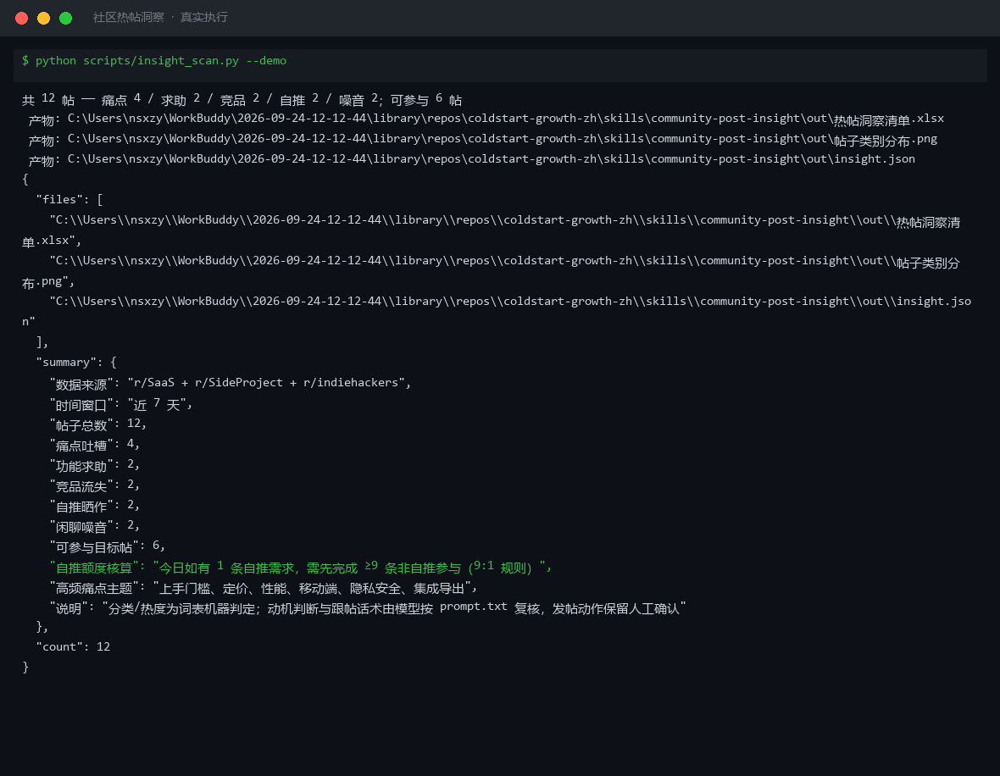

# 截图与录屏

> 以下素材均来自**真实执行**：`--run` 实拍终端 / 实跑产物文件，无摆拍。

## 演示视频


*四幕数据叙事（Hyperframes 动态渲染 19s）：业务钩子 → 真实执行 → 指标条形图生长 → 交付物*

## 执行截图



## 实跑产物

| 文件 | 说明 |
|---|---|
| [`out/insight.json`](out/insight.json) | 结构化结果（实跑生成） · 7 KB |
| [`out/帖子类别分布.png`](out/帖子类别分布.png) | 图表产物（实跑生成） · 36 KB |
| [`out/热帖洞察清单.xlsx`](out/热帖洞察清单.xlsx) | Excel 工作簿（实跑生成） · 10 KB |


---

## 附录：实跑输出明细

> 本资产为纯提示词客户端资产，无界面可截图。以下为**实跑运行效果**。

## 运行效果

### 输入

```json
{
  "source": "用户提供的数据来源或粘贴的原始内容",
  "scope": "覆盖退换货、售后、投诉处理"
}

```

### 输出

> 「AI 生成内容」标识

## 采集结果

| # | 标题/摘要 | 来源 | 时间 | 关键信息 |
|---|---|---|---|---|
| — | — | — | — | — |

## 概要

本次未能采集到具体热帖数据，因为输入中的 `source` 仅为占位说明（"用户提供的数据来源或粘贴的原始内容"），未提供真实的社区链接、subreddit 名称或具体帖子内容。请在 `source` 中补充具体数据来源后重新执行。


---

*运行效果由实跑验证生成*
