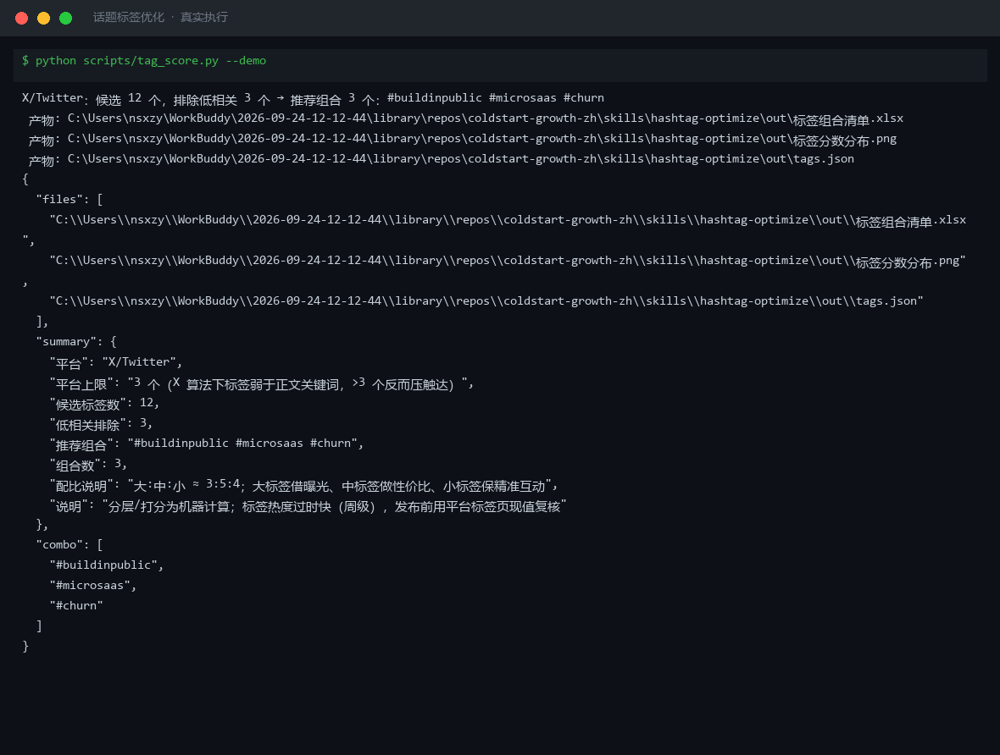
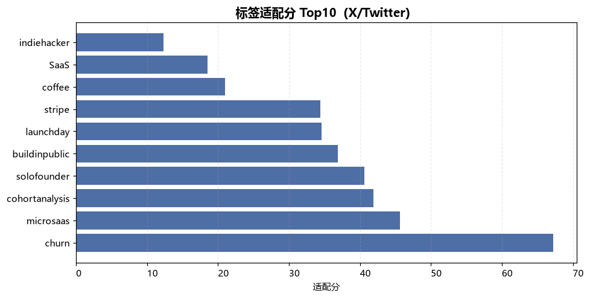
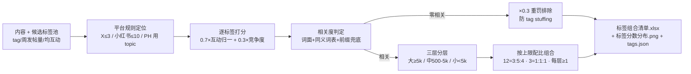

# 话题标签优化 Hashtag Optimize

> 原子技能 ｜ 属于「出海增长官」 ｜ 冷启动期独立开发者（OPC）客群 ｜ T1 产物型（脚本交付真实文件）
>
> **为一篇内容在指定平台配一组分层均衡、与内容强相关的标签组合，每个标签注明层级与承担角色。**
> 6 平台硬上限规则 + 大/中/小三层配比（满配 3:5:4）+ 适配分公式（70% 互动归一 + 30% 竞争度衰减）+ 零相关重罚排除防 tag stuffing · 一次计算输出 Excel 组合清单与分数分布图



🎬 **[▶ 观看演示视频（在线播放）](https://cdn.jsdelivr.net/gh/bangwozuo/coldstart-growth-zh@main/skills/hashtag-optimize/docs/assets/demo.mp4) · [GitHub 页](https://github.com/bangwozuo/coldstart-growth-zh/blob/main/skills/hashtag-optimize/docs/assets/demo.mp4)** — 四幕创作叙事：业务钩子 → 真实执行 → 要点到成稿演变 → 交付物

*上图来自真实执行：X/Twitter 平台 12 个候选标签，低相关排除 3 个，推荐组合 `#buildinpublic #microsaas #churn`（上限 3 = 大1:中1:小1），产物落盘 Excel + PNG + JSON。*

---

## 它做什么（分层评估 → 配比组合 → 排除低相关）

### 一、平台硬上限（超上限触达反降）

| 平台 | 标签数上限 | 依据 |
|---|---|---|
| X/Twitter | 3 | X 算法下标签弱于正文关键词，>3 个反而压触达 |
| TikTok | 6 | 3-6 个；至少 1 个中小标签否则淹没在热标签流 |
| 小红书 | 10 | ≤10 个；前 3 个决定分发池 |
| Instagram | 5 | 3-5 个精准标签优于 30 个泛标签 |
| Product Hunt | 5 | PH 用 topic（非 # 标签），选 3-5 个 |

### 二、三层配比法（按周发帖量分层）

| 层级 | 周发帖量 | 承担角色 | 示例 |
|---|---|---|---|
| 大 | ≥5000 | 借曝光池，但单帖 10 分钟内被冲走 | #startup、#SaaS |
| 中 | 500–5000 | **性价比区**：能在标签页停留数小时 | #microsaas、#buildinpublic |
| 小 | <500 | 精准小池，互动率最高，「让对的人看到」 | #cohortanalysis |

**配比**：满配 12 个 = 大3 : 中5 : 小4；上限受限时递减（3 个 = 1:1:1、5 个 = 1:2:2）——**任何一层数量为 0 都是坏组合**：全大标签 = 无人看到，全小标签 = 池子太小。

### 三、适配分（脚本口径）

```text
适配分 = 0.7 × 单帖均互动归一分（0–200 归一） + 0.3 × 竞争度分（1/(1+周发帖量/1000)）
零相关标签（词面零重合，同义词表 + 前缀兜底后仍无关）→ 适配分 ×0.3 并标记「排除」
```

堆无关热标签（tag stuffing）会被平台判垃圾行为，宁缺毋滥。

## 真实输入 → 真实输出

**输入**（`examples/input.json`）：X/Twitter 平台 + 一段 churn analytics 产品文案 + 12 个候选标签（各带周发帖量与单帖均互动）。

**输出**（脚本实跑，节选，完整见 [`examples/output.md`](examples/output.md)）：

| 标签 | 层级 | 周发帖量 | 单帖均互动 | 相关度 | 适配分 | 判定 |
|---|---|---|---|---|---|---|
| #churn | 小 | 380 | 130 | 1.0 | 67.2 | ✅ 进组合 |
| #microsaas | 中 | 2,400 | 105 | 1.0 | 45.6 | ✅ 进组合 |
| #buildinpublic | 大 | 8,200 | 96 | 1.0 | 36.9 | ✅ 进组合（因配比入选） |
| #coffee | 大 | 480,000 | 210 | 0.0 | 21.0 | ❌ 低相关·排除 |
| #startup | 大 | 150,000 | 30 | 1.0 | 18.5 | ⚠ 备选（竞争度过高） |

> #coffee 单帖均互动最高（210）但与内容零相关——堆无关热标签是 tag stuffing，重罚排除。

**实跑产物**：



- `out/标签组合清单.xlsx`（评估明细 · 低相关标红 / 推荐组合 / 汇总 三个 sheet）
- `out/标签分数分布.png`（各标签适配分柱状图，上图）
- `out/tags.json`（机器可读结果，供工作流读取）

## 处理流水线



## 快速开始

**方式一：提示词（任意 AI 工具）**

```text
1. 打开 prompt.txt，全文复制
2. 粘贴到 Coze / WorkBuddy / Dify / Claude / ChatGPT
3. 按 schema.json 的输入规格提供：platform + content + tag_pool（含周发帖量/均互动）
```

**方式二：脚本（零 AI 依赖，确定性计算）**

```bash
# 演示模式（内置真实样例）
python scripts/tag_score.py --demo
# 指定输入
python scripts/tag_score.py --input examples/input.json --outdir out
```

依赖：`pip install openpyxl`（缺失时脚本会打印修复命令，不静默失败）。

## 面向谁 / 什么时候用

| ✅ 该用 | ❌ 别用 |
|---|---|
| 一稿多平台发布前逐平台配标签 | 把小红书习惯（10 个标签）带到 X（触达反降） |
| 想排除「看着热闹实则无关」的热标签 | Reddit 用 flair 不用 #（# 标签帖会被版主删） |
| 需要每个标签注明层级与承担角色、可核对 | 承诺「上了这个标签必爆」（标签只影响分发池） |

## 边界与合规

- 本资产输出为 **AI 辅助生成内容**；标签热度是快照、**周级过时**，发布前用平台标签页现值复核，相差 2 倍以上重算层级
- 不虚构热度数据：没有周发帖量/均互动时列清单让用户补，不填默认值
- 不推荐与内容无关的热门标签蹭流量；词面相关 ≠ 语义相关，模型须复核跑题标签

## 文件地图

```text
├── README.md                ← 本文件
├── SKILL.md                 ← 资产定义（元信息 / 契约 / 边界）
├── prompt.txt               ← 提示词本体（平台规则 + 三层配比 + 适配分公式）
├── schema.json              ← 输入输出契约（机器可读）
├── scripts/tag_score.py     ← 确定性计算脚本（分层打分 → Excel/PNG/JSON）
├── examples/                ← 真实输入 + 脚本实跑输出
├── docs/                    ← 9 项配套文档（架构 / 流程 / 场景 / 测试报告…）
└── out/                     ← 实跑产物（标签组合清单.xlsx / 标签分数分布.png / tags.json）
```

---

*本资产遵循 [bangwozuo 数字员工资产规范](https://github.com/bangwozuo/digital-employee-spec) v3.0 ｜ [所属员工：出海增长官](../../) ｜ [总入口](https://github.com/bangwozuo/digital-employees-hub-zh)*
