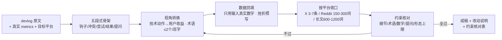

# 叙事改写 Narrative Rewrite

> 原子技能 ｜ 属于「出海增长官」 ｜ 冷启动期独立开发者（OPC）客群 ｜ T2 纯提示词（无脚本依赖）
>
> **把技术日志（devlog）改写成用户视角的 build-in-public 内容：让不写代码的读者想看完并愿意回一句。不编数据、不装用户、不写软文。**
> 五段式叙事结构（钩子/冲突/尝试/结果/提问）+ 技术动作→用户收益视角转换（非必要术语 ≤2 个/百字）+ 数据诚实规则（只用真实数字）+ 4 平台形态收口


*上图来自 `examples/output.md` 实跑产物：一篇 devlog 改写为 r/SideProject 版（正文 268 词），术语密度实测 1.1 个/百字，全部数字来自输入（47 用户 / MRR ¥312 / 8s→2.1s），6 项约束逐项核对通过。*

---

## 它做什么（五段式 + 视角转换 + 数据诚实）

### 一、叙事结构（五段式，顺序固定）

| # | 段 | 要求 |
|---|---|---|
| 1 | 钩子（前 2 行） | 具体的时间/数字/瞬间开头：「重构了缓存层」没人看；「凌晨 1 点，用户发消息说你的页面要转 8 秒才开」有人看。前 2 行决定 80% 完读率，必须含至少一个具体细节 |
| 2 | 冲突 | 那个问题当时怎么卡住你（用户视角的痛，不是你的技术债） |
| 3 | 尝试 | 你做了什么、为什么选这条路（一句技术原因即可，展开是博客的事） |
| 4 | 结果 | 真实数字，**包括没修好的部分**——「注册转化 2.1% → 3.4%，激活还没动」比「大幅提升」可信 10 倍 |
| 5 | 提问 | 向读者要一个具体回复（「你们的缓存策略是什么？」）。提问决定评论区活跃度，没提问的 devlog 只是日记 |

### 二、视角转换规则（这是本职，逐条检查）

- 每个技术动作必须回答「这对用户意味着什么」：「重构缓存层」→「页面从 8 秒到 2 秒」；「加了 Redis 队列」→「导出报表不再卡死浏览器」
- 消灭未翻译术语：每个术语（cache / queue / idempotency）要么给出用户侧后果，要么删除；成稿自查：**非必要术语 ≤2 个/百字**
- 用户收益排前，技术选型排后：先说「2 秒」再说「Redis」

### 三、数据诚实规则（build-in-public 的生命线）

| # | 规则 |
|---|---|
| 1 | 星标数、用户数、收入数**只用输入里的真实数字**；没有的就不写，绝不估算、绝不用「数百用户」模糊膨胀 |
| 2 | traction 造假 = 社区永久拉黑，且截图永久留档——宁可这周没数据可写 |
| 3 | 挫折照写：翻车周、零增长周照常发。真实、包含失败的叙事比纯晒帖更容易换来有质量的回复 |
| 4 | 不引用不存在的用户语录；用户反馈给原文链接或原句摘录 |

### 四、平台适配参数

| 平台 | 形态上限 | 关键约束 |
|---|---|---|
| X/Twitter | thread 3-7 条，首帖 ≤280 字符 | 一条只讲一个点；首帖即钩子 |
| Reddit r/SideProject | 正文 150-300 词 | 故事优先；自推只在允许自推的 sub 发 |
| Reddit r/SaaS 等讨论型 sub | 以评论参与为主 | 需先参与讨论建立足迹，devlog 不裸发 |
| Indie Hackers / dev.to | 长文 600-1200 词 | 可保留技术细节段落，仍须用户视角开头 |

## 真实输入 → 真实输出

**输入**（`examples/input.json`）：一篇 Week 40 devlog 原文（缓存重构 + CSV 导出队列化）+ 真实 metrics（47 用户 / MRR ¥312 / 响应 8s→2.1s）+ platform=Reddit r/SideProject。

**输出**（按 prompt.txt 方法论产出，节选，完整见 [`examples/output.md`](examples/output.md)）：

| # | 原文（技术视角） | 改写后（用户视角） | 理由 |
|---|---|---|---|
| 1 | 引入 Redis 做二级缓存 | 「最贵的查询加了二级缓存」+ 8s→2.1s | 用户关心等待时间，不关心组件名 |
| 2 | 导出改成队列异步处理 | 「CSV 导出挪到后台慢慢跑，不再卡住整个站点」 | 「队列/主线程」翻译成可感知的「不卡了」 |
| 3 | 缓存击穿把 DB 打满 | 「缓存被打穿，数据库满载，20 分钟后降级恢复」 | 保留失败细节，术语减到最低 |
| 4 | （原文无数据） | 47 位用户，MRR ¥312 | 全部来自输入 metrics，未新增未膨胀 |

**约束核对**：钩子含具体细节 ✅（凌晨 1 点 + 8 秒）｜术语密度 1.1 个/百字 ✅｜数字全部来自原文 ✅｜结尾含具体提问 ✅｜平台形态 268 词（150-300 内）✅｜含失败细节、无效果承诺 ✅

## 处理流水线



## 快速开始

**提示词方式（任意 AI 工具，3 步）**

```text
1. 打开 prompt.txt，全文复制
2. 粘贴到 Coze / WorkBuddy / Dify / Claude / ChatGPT
3. 按 schema.json 的输入规格提供：devlog 原文 + 真实 metrics + 目标平台
```

纯提示词资产，无脚本、无依赖、无 API Key。

## 面向谁 / 什么时候用

| ✅ 该用 | ❌ 别用 |
|---|---|
| 每周 devlog 转 build-in-public 帖（节奏比体量重要，写不了长文就发 3 条短 thread） | 把 devlog 写成 changelog（全是「修了 X 加了 Y」，没有冲突与人物） |
| 需要约束核对表保证数字可溯源 | 数字膨胀（47 用户写成「近 50」一律禁止） |
| 在允许自推的 sub 发带身份披露的开发故事 | 在禁止自推的 sub 版本里放产品链接、写成纯软文 |

## 边界与合规

- 本资产输出为 **AI 辅助生成内容**，发布前必须人工确认，发布者身份按开发者实名披露
- 不新增输入中没有的数字、用户语录、效果承诺；不用「最」「第一」「100%」绝对词
- 不伪装用户口吻；build-in-public 的交换物是「真实过程」，不是广告位（各 sub 的 9:1 参与比同样适用）
- 周更断档 2 周以上关注者流失过半——工具救不了断更，节奏自己守

## 文件地图

```text
├── README.md                ← 本文件
├── SKILL.md                 ← 资产定义（元信息 / 契约 / 边界）
├── prompt.txt               ← 提示词本体（五段式 + 视角转换 + 数据诚实规则）
├── schema.json              ← 输入输出契约（机器可读）
├── examples/                ← 真实输入 + 方法论产出示例
└── docs/                    ← 9 项配套文档（架构 / 流程 / 场景 / 测试报告…）
```

---

*本资产遵循 [bangwozuo 数字员工资产规范](https://github.com/bangwozuo/digital-employee-spec) v3.0 ｜ [所属员工：出海增长官](../../) ｜ [总入口](https://github.com/bangwozuo/digital-employees-hub-zh)*
