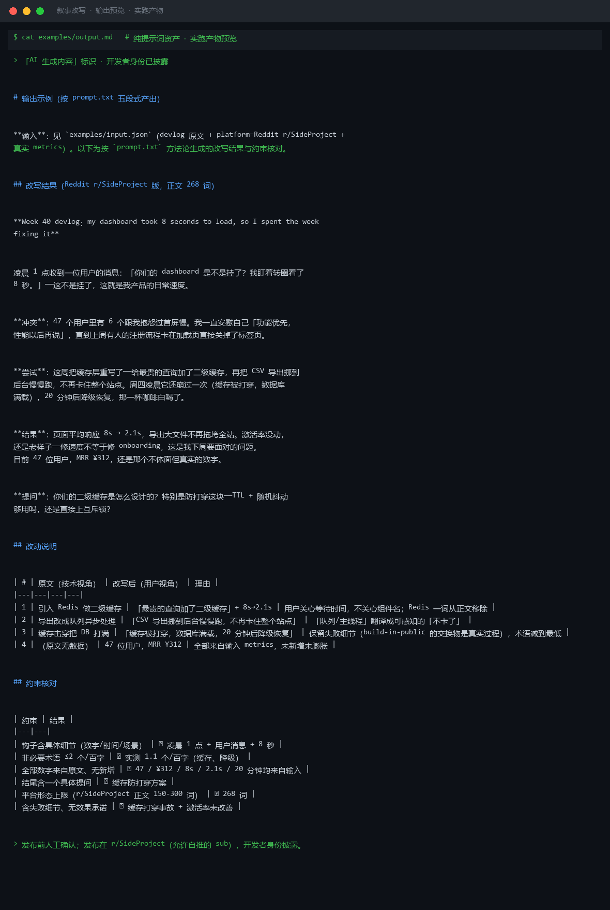

# 截图与录屏

> 以下素材均来自**真实执行**：`--run` 实拍终端 / 实跑产物文件，无摆拍。

## 演示视频


*四幕创作叙事（Hyperframes 动态渲染 19s）：业务钩子 → 真实执行 → 输入要点到成稿演变 → 交付物*

## 执行截图




---

## 附录：实跑输出明细

> 本资产为纯提示词客户端资产，无界面可截图。以下为**实跑运行效果**。

## 运行效果

### 输入

```json
{
  "content": "需要处理的文本内容",
  "target": "待校验的版本内容",
  "platform": "小红书"
}

```

### 输出

> 「AI 生成内容」标识

## 改写结果

（未能生成，原因见下方说明）

## 改动说明

| # | 原文要点 | 改动后 | 改动理由 |
|---|---|---|---|
| — | — | — | — |

## 约束核对

1. 输入字段 `content` 为占位文本 "需要处理的文本内容"，缺少需要改写的原始文本。
2. 依据工作原则，不基于虚构内容执行改写。请补充 `content` 与明确的 `target` 要求后重新执行。


---

*运行效果由实跑验证生成*
