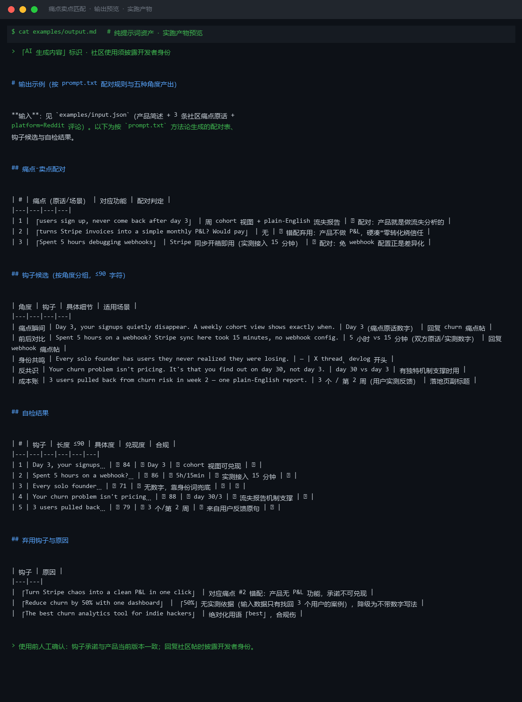
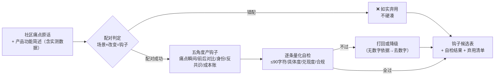

# 痛点卖点匹配 Painpoint Sellingpoint Match

> 原子技能 ｜ 属于「出海增长官」 ｜ 冷启动期独立开发者（OPC）客群 ｜ T2 纯提示词（无脚本依赖）
>
> **把社区里挖到的真实痛点与产品功能配对，产出「第一眼让人对号入座」的钩子文案——每条过量化自检，错配的如实弃用。**
> 5 种钩子角度公式 + 配对规则（场景×改变=钩子）+ 5 项量化自检（≤90 字符/具体细节/兑现度/零绝对词）· 一个痛点至少 3 个角度供选



🎬 **[▶ 观看演示视频（在线播放）](https://cdn.jsdelivr.net/gh/bangwozuo/coldstart-growth-zh@main/skills/painpoint-sellingpoint-match/docs/assets/demo.mp4) · [GitHub 页](https://github.com/bangwozuo/coldstart-growth-zh/blob/main/skills/painpoint-sellingpoint-match/docs/assets/demo.mp4)** — 四幕创作叙事：业务钩子 → 真实执行 → 要点到成稿演变 → 交付物

*上图来自 `examples/output.md` 实跑产物：3 条痛点配对判定 2✅ 1❌（错配弃用），产出 5 个角度的钩子候选并逐条自检，另有 3 条弃用钩子附原因。*

---

## 它做什么（先配对，再写句）

### 一、痛点→卖点配对规则

**配对公式：用户原话里的场景 × 产品功能带来的具体改变 = 钩子**

| # | 规则 | 说明 |
|---|---|---|
| 1 | 场景取自痛点原话 | 帖子说「spent 5 hours debugging webhooks」，钩子就用「5 小时」，不用你造的「几分钟搞定」 |
| 2 | 改变必须能兑现 | 产品没有的功能不进钩子；「8s → 2s」可以写，「提速 10 倍」没有实测依据就不写 |
| 3 | 一对多输出 | 一个痛点至少给 3 个不同角度的钩子，按平台选 |
| 4 | 错配就明说 | 找不到能兑现的功能就弃用该痛点——硬凑的钩子转化率为零还烧信任 |

### 二、五种钩子角度（每个角度一句话公式）

| 角度 | 公式 | 适用 |
|---|---|---|
| 痛点瞬间 | 「{具体时间/场景}，你正在 {痛的行为}」 | 社区评论、回复痛点帖 |
| 前后对比 | 「{旧状态·具体数字} → {新状态·具体数字}」 | 落地页首屏、devlog |
| 身份共鸣 | 「每个 {身份} 都经历过 {具体场景}」 | X thread、长文开头 |
| 反共识 | 「大家都在 {常规做法}，但你可能不需要」 | 有独特机制的差异化产品 |
| 成本账 | 「你每月花 {金额/小时} 在 {琐事} 上」 | 定价敏感型受众 |

### 三、量化质量标准（每条钩子逐项自检）

| # | 检查项 | 标准 |
|---|---|---|
| 1 | 长度 | X/Reddit 版 ≤90 字符；落地页首屏 ≤20 字（中文按字计） |
| 2 | 具体度 | 至少一个具体细节（数字/时间/工具名/场景）；全抽象的「让效率翻倍」直接打回 |
| 3 | 对号入座 | 目标用户 3 秒内能判断「这说的是我」；非目标行业的人也觉得说的是自己 = 太泛 |
| 4 | 兑现度 | 钩子承诺的事，落地页首屏与产品必须能兑现；做不到的承诺删掉 |
| 5 | 零合规伤 | 无绝对化用语（最/第一/100%），无编造数字，无冒充用户口吻 |

## 真实输入 → 真实输出

**输入**（`examples/input.json`）：产品简述（ChurnLens 流失分析 SaaS，含实测数据）+ 3 条社区痛点原话 + platform=Reddit 评论。

**输出**（按 prompt.txt 方法论产出，节选，完整见 [`examples/output.md`](examples/output.md)）：

| # | 痛点（原话/场景） | 对应功能 | 配对判定 |
|---|---|---|---|
| 1 | 「users sign up, never come back after day 3」 | 周 cohort 视图 + plain-English 流失报告 | ✅ 配对 |
| 2 | 「turns Stripe invoices into a simple monthly P&L? Would pay」 | 无 | ❌ 错配弃用：产品不做 P&L，硬凑=零转化烧信任 |
| 3 | 「Spent 5 hours debugging webhooks」 | Stripe 同步开箱即用（实测接入 15 分钟） | ✅ 配对：免 webhook 配置正是差异化 |

| 角度 | 钩子（≤90 字符） | 具体细节 | 适用场景 |
|---|---|---|---|
| 痛点瞬间 | Day 3, your signups quietly disappear. A weekly cohort view shows exactly when. | Day 3（痛点原话数字） | 回复 churn 痛点帖 |
| 前后对比 | Spent 5 hours on a webhook? Stripe sync here took 15 minutes, no webhook config. | 5 小时 vs 15 分钟 | 回复 webhook 痛点帖 |
| 成本账 | 3 users pulled back from churn risk in week 2 — one plain-English report. | 3 个 / 第 2 周（用户实测反馈） | 落地页副标题 |

**弃用钩子与原因**（防翻车同等重要）：「Reduce churn by 50%」——「50%」无实测依据，降级为不带数字写法；「The best churn analytics tool」——绝对化用语「best」，合规伤。

## 处理流水线



## 快速开始

**提示词方式（任意 AI 工具，3 步）**

```text
1. 打开 prompt.txt，全文复制
2. 粘贴到 Coze / WorkBuddy / Dify / Claude / ChatGPT
3. 按 schema.json 的输入规格提供：产品简述（含真实实测数据）+ 痛点原话 + 目标平台
```

纯提示词资产，无脚本、无依赖、无 API Key。

## 面向谁 / 什么时候用

| ✅ 该用 | ❌ 别用 |
|---|---|
| 挖到痛点帖后要写回复钩子/落地页首屏 | 直接搬运楼主原话做广告（社区拉黑级行为，句子必须重写） |
| 痛点与功能配对判定，错配早止损 | 为未实现的功能写钩子、编造用户案例与效果承诺 |
| 需要每条钩子可核对的自检结果 | 钩子与落地页各说各话（钩子确定后回填首屏，保持同源） |

## 边界与合规

- 本资产输出为 **AI 辅助生成内容**，使用前人工确认承诺可兑现、与产品当前版本一致
- 在社区使用钩子须**披露开发者身份**；不伪装用户口吻
- 不使用绝对化用语与「保证」「必」类承诺词；数字必须有输入依据，无出处就降级为不带数字的写法
- 钩子骗来的点击会在落地页加倍还回来——兑现度自检不是可选项

## 文件地图

```text
├── README.md                ← 本文件
├── SKILL.md                 ← 资产定义（元信息 / 契约 / 边界）
├── prompt.txt               ← 提示词本体（配对规则 + 五角度 + 量化自检）
├── schema.json              ← 输入输出契约（机器可读）
├── examples/                ← 真实输入 + 方法论产出示例
└── docs/                    ← 9 项配套文档（架构 / 流程 / 场景 / 测试报告…）
```

---

*本资产遵循 [bangwozuo 数字员工资产规范](https://github.com/bangwozuo/digital-employee-spec) v3.0 ｜ [所属员工：出海增长官](../../) ｜ [总入口](https://github.com/bangwozuo/digital-employees-hub-zh)*
