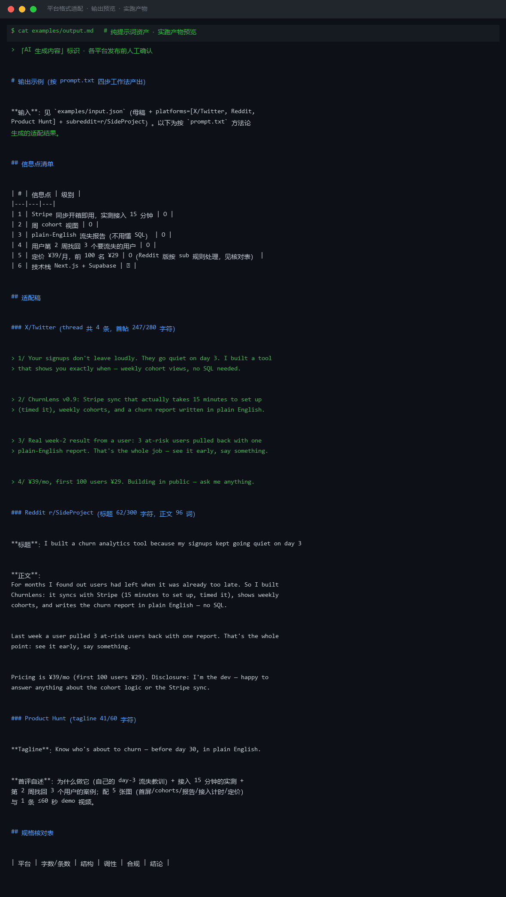
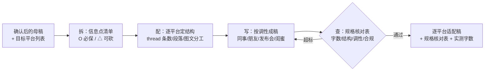

# 平台格式适配 Platform Format Adapt

> 原子技能 ｜ 属于「出海增长官」 ｜ 冷启动期独立开发者（OPC）客群 ｜ T2 纯提示词（无脚本依赖）
>
> **把一篇母稿改写成 N 个平台的合格版本：每个版本符合该平台字数上限、结构与调性，核心信息一条不丢、一条不编。**
> 6 平台硬规格表（X ≤280 字符 / PH tagline ≤60 字符 / 小红书标题 ≤20 字）+ 信息点保真纪律（数字不改写不换算）+ 四步工作法（拆/配/写/查）+ 逐平台规格核对表




*上图来自 `examples/output.md` 实跑产物：一篇母稿适配 X（4 条 thread）/ Reddit（96 词）/ Product Hunt（tagline 41/60 字符）三平台，6 个信息点 5 保 1 砍，逐平台规格核对全部 ✅。*

---

## 它做什么（同源多形，不是复制粘贴）

### 一、平台规格表（硬上限，逐项核对）

| 平台 | 硬规格 | 结构与调性 |
|---|---|---|
| X/Twitter | 单帖 ≤280 字符；thread ≤7 条 | 一帖一点；首帖 = 钩子；数字进正文比标签有效 |
| Reddit 帖 | 标题 ≤300 字符且禁标题党 | 正文先给信息量再提产品；无上下文裸贴链接 = 最高频删帖原因 |
| Reddit 评论 | ≤1500 字符（建议 ≤200 词） | 直接回答问题；披露身份放最后一句 |
| Product Hunt | tagline ≤60 字符；首评自述 | 配套 5 张图 + ≤60 秒 demo 视频；首日评论逐条回复 |
| 小红书 | 标题 ≤20 字；正文 ≤1000 字 | emoji 分段；前 2 行决定打开后完读 |
| Indie Hackers / dev.to | 长文 600-1200 词 | 可保留技术细节；标题 ≤60 字符 |

*平台上限以官方页面最新公示为准（本表为 2026-Q3 快照）。*

### 二、信息保真规则（同源多形的底线）

| # | 规则 |
|---|---|
| 1 | **信息点清单先行**：改写前列清单（数字/事实/承诺），改写后逐平台核对——数字不得改写（8s→2.1s 不能写成「快了 4 倍」）、事实不得增删、承诺不得升级 |
| 2 | **取舍优先级**：字数不够按「数字 > 场景 > 功能 > 形容词」砍——形容词先死，数字活到最后 |
| 3 | **调性校准**：Reddit 像同事说话；X 像朋友报信；PH 像产品发布会；小红书像闺蜜安利。换说法，不换事实 |
| 4 | **禁止直接搬运**：X thread 原样贴 Reddit = 被删+扣社区信誉；小红书 emoji 风贴 X = 触达腰斩 |

### 三、四步工作法（每篇母稿都走一遍）

1. **拆**：母稿 → 信息点清单（编号，标 O 必保 / △ 可砍）
2. **配**：按目标平台规格表定结构（thread 条数 / 正文段落 / 图文分工）
3. **写**：按调性逐平台成稿，每平台版末尾标实测字数
4. **查**：逐平台过规格核对表（字数/结构/调性/合规），**超标回炉重写，不硬截断**

## 真实输入 → 真实输出

**输入**（`examples/input.json`）：母稿（ChurnLens 发布文案）+ platforms=[X/Twitter, Reddit, Product Hunt] + subreddit=r/SideProject。

**输出**（按 prompt.txt 方法论产出，节选，完整见 [`examples/output.md`](examples/output.md)）：

| 平台 | 字数/条数 | 结构 | 调性 | 合规 | 结论 |
|---|---|---|---|---|---|
| X/Twitter | 4 条 ≤7；首帖 247/280 | 首帖=钩子，一帖一点 | 朋友报信 | 无绝对词；数字未变形 | ✅ |
| Reddit r/SideProject | 标题 62/300；正文 96 词 | 先信息量后披露 | 同事口吻 | 自推合规；身份披露在末句 | ✅ |
| Product Hunt | tagline 41/60 | 产品发布会 | 利益直给 | 无绝对词；5 图 + ≤60s 视频清单 | ✅ |

**弃用与回炉记录**：技术栈（Next.js + Supabase）为 △ 级信息点，三平台全部砍除——平台上没人因此转化。

## 处理流水线



## 快速开始

**提示词方式（任意 AI 工具，3 步）**

```text
1. 打开 prompt.txt，全文复制
2. 粘贴到 Coze / WorkBuddy / Dify / Claude / ChatGPT
3. 按 schema.json 的输入规格提供：母稿 + 目标平台列表（+ sub 名，如有 Reddit）
```

纯提示词资产，无脚本、无依赖、无 API Key。

## 面向谁 / 什么时候用

| ✅ 该用 | ❌ 别用 |
|---|---|
| 一稿多平台发布前的逐平台改写 | 内容策划与选题（那是上游技能的事，本技能只做同源多形） |
| 母稿超长需要按平台砍字数（按优先级砍，不截断） | 字数超标硬删尾（截掉的是钩子或数字，应回炉重写） |
| 需要逐平台核对表保证信息保真 | 数字换算（8s→2.1s 写成「提速 4 倍」也是改数字，禁止） |

## 边界与合规

- 本资产输出为 **AI 辅助生成内容**，各平台发布前必须人工确认
- 不新增母稿没有的数字、功能与承诺；不用绝对化用语；不伪装用户口吻
- 不在禁止自推的平台/sub 放产品链接；**超标版本不出手——宁可少一个平台，不发违规版本**
- 平台上限以官方页面最新公示为准（规格表为 2026-Q3 快照）

## 文件地图

```text
├── README.md                ← 本文件
├── SKILL.md                 ← 资产定义（元信息 / 契约 / 边界）
├── prompt.txt               ← 提示词本体（平台规格表 + 信息保真 + 四步工作法）
├── schema.json              ← 输入输出契约（机器可读）
├── examples/                ← 真实输入 + 方法论产出示例
└── docs/                    ← 9 项配套文档（架构 / 流程 / 场景 / 测试报告…）
```

---

*本资产遵循 [bangwozuo 数字员工资产规范](https://github.com/bangwozuo/digital-employee-spec) v3.0 ｜ [所属员工：出海增长官](../../) ｜ [总入口](https://github.com/bangwozuo/digital-employees-hub-zh)*
