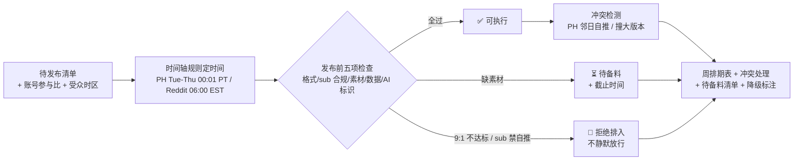

# 发布排期 Publish Schedule

> 原子技能（T4 调度型）｜ 属于「出海增长官」 ｜ 冷启动期独立开发者（OPC）客群 ｜ T4 SOP 深度提示词 + 只读连接器
>
> **把待发布内容排成可执行的周排期表：每个动作有明确时间点、前置条件与人工确认环节。不自动执行任何发布——所有对外发布由人工执行。**
> 4 平台时间轴规则（PH 周二至周四 00:01 PT / Reddit 工作日 06:00 EST / 同 sub 间隔 ≥3 天）+ 9:1 参与比门槛 + 三类人工确认点 + 3 个只读连接器（无平台写权限）


*上图来自 `examples/output.md` 实跑产物：2026-10-05 起一周排期，4 个发布动作排为 3 个「✅ 可执行」+ 1 个「⏳ 待备料」（PH 缺 demo 视频），PH 与 Reddit 邻日冲突按红线处理，2 项检查标注「未核对-降级」。*

---

## 它做什么（时间轴规则 → 发布前检查 → 人工确认点）

### 一、时间轴规则（排什么时间，有依据）

| 平台 | 排期规则 | 依据 |
|---|---|---|
| Product Hunt | **周二至周四**发布；00:01 PT 上线抢当日榜 | 避开周末流量低谷；00:01 PT = 全天 24 小时投票窗口最长 |
| X/Twitter | 工作日 09:00-11:00 与 20:00-22:00（目标受众时区）；同日 thread ≤1、散帖 ≤3 | 欧美开发者双高峰；超频率触发限流风险 |
| Reddit | 工作日 06:00-08:00 EST（美东上班前）；**同 sub 间隔 ≥3 天** | 上班前刷贴高峰；连发自推必被识别 |
| 小红书 | 12:00-13:00 或 21:00-23:00；同日 ≤2 篇 | 午休+睡前双高峰 |

发布时间按**目标用户所在时区**排，不是自己的时区——出海产品的晚上 9 点是用户的早上。

### 二、发布前检查（每个动作的前置条件，缺一项就不排）

| # | 检查项 | 内容 |
|---|---|---|
| 1 | 格式合规 | 内容已过 platform-format-adapt 规格核对（字数/结构/调性） |
| 2 | Sub 合规 | Reddit 目标 sub 版规允许该内容形态；账号 9:1 参与比达标（近 10 条中自推 ≤1） |
| 3 | 素材齐备 | PH = 5 张图 + ≤60 秒 demo 视频 + tagline ≤60 字符 + 首评草稿；缺素材排「待备料」 |
| 4 | 数据真实 | 帖内数字与产品实际一致（与 weekly-data-review 的最新数据核对） |
| 5 | AI 标识 | 按平台要求确认 AI 生成内容标注方案 |

### 三、人工确认点（T4 硬要求）

| 确认点 | 时机 | 确认内容 |
|---|---|---|
| 排期确认 | 排期表生成后 | 整周节奏是否与产品节奏冲突（如大版本日不排 PH） |
| 发布前确认 | 每个动作执行前 | 内容终稿 + 平台状态（sub 版规无更新、账号无风控提示） |
| 发布后确认 | 发布后 1 小时 | PH 首日评论逐条回复启动；Reddit 帖 30 分钟内首次互动检查 |

### 四、只读连接器（数据来源与降级路径）

| 连接器 | 用途 | 降级路径 |
|---|---|---|
| Plausible（API Token 只读） | 落地页流量核对 | API 不可用 → 用户手工读面板数字填入 |
| Reddit API（OAuth 2.0 只读） | sub 版规/热度核对 | 限额用尽 → 人工浏览 sub 侧边栏核对 |
| X API（Bearer 只读） | 历史帖表现、账号健康 | API 不可用 → 跳过该项，标注「未核对」 |

**授权边界**：三个连接器全部只读，无任何平台写权限。连接器不可用时排期照常产出，对应检查项标注「未核对-降级」，不阻塞、不编造核对结果。

## 真实输入 → 真实输出

**输入**（`examples/input.json`）：3 条待发布内容 + 账号参与比状态 + week_start=2026-10-05 + 受众时区 America/Los_Angeles。

**输出**（按 prompt.txt SOP 规则产出，节选，完整见 [`examples/output.md`](examples/output.md)）：

| 日期 | 时间 | 平台 | 内容 | 前置条件 | 状态 |
|---|---|---|---|---|---|
| 周二 10-06 | 06:00 EST | Reddit r/SideProject | v0.9 devlog | 9:1 达标 ✅；格式核对 ✅ | ✅ 可执行 |
| 周三 10-07 | 00:01 PT | Product Hunt | ChurnLens PH Launch | ❌ 缺 demo 视频 | ⏳ 待备料 |
| 周四 10-08 | 09:00 PT | Indie Hackers | 流失分析教程长文 | 格式核对 ✅；600-1200 词达标 | ✅ 可执行 |

**冲突与处理**：PH Launch（周三）与 Reddit devlog（周二）间隔仅 1 天 → Reddit 帖不放 PH 链接、不发「求投票」（刷 upvote 红线），两内容主题错开。

## 处理流水线



## 快速开始

**提示词方式（任意 AI 工具，3 步）**

```text
1. 打开 prompt.txt，全文复制
2. 粘贴到 Coze / WorkBuddy / Dify / Claude / ChatGPT
3. 按 schema.json 的输入规格提供：待发布清单 + 账号参与比状态 + week_start + 受众时区
```

纯提示词资产（只读连接器可选），无平台写权限、无自动发布。

## 面向谁 / 什么时候用

| ✅ 该用 | ❌ 别用 |
|---|---|
| 每周日生成下周排期、新内容确认后插入排期 | 自动执行发布（本技能无平台写权限，发布永远人工） |
| PH 发布日规划（只排周二至周四，避开周末低谷） | 周末发 PH（流量低谷直接把发布日废掉） |
| 9:1 不达标时的排期拦截（拒绝排入自推） | 刷 upvote / 点赞小组（排期表不为任何刷量动作排位） |

## 边界与合规

- 本资产输出为 **AI 辅助生成内容**；本排期不含任何自动发布，执行由人工完成
- ❌ 不刷 upvote、不买假用户、不安排点赞小组；不伪装用户口吻，自推内容披露开发者身份
- 数据真实：为凑排期而夸大 traction 的内容**不予排期**
- 排期确认点拦截「PH 发布日撞大版本」类冲突（当天既发 PH 又改价/迁移，客服与评论两头烧）

## 文件地图

```text
├── README.md                ← 本文件
├── SKILL.md                 ← 资产定义（元信息 / 契约 / 边界）
├── prompt.txt               ← 提示词本体（时间轴规则 + 发布前检查 + 人工确认点）
├── schema.json              ← 输入输出契约（机器可读）
├── examples/                ← 真实输入 + SOP 产出示例
└── docs/                    ← 9 项配套文档（架构 / 流程 / 场景 / 测试报告…）
```

---

*本资产遵循 [bangwozuo 数字员工资产规范](https://github.com/bangwozuo/digital-employee-spec) v3.0 ｜ [所属员工：出海增长官](../../) ｜ [总入口](https://github.com/bangwozuo/digital-employees-hub-zh)*
