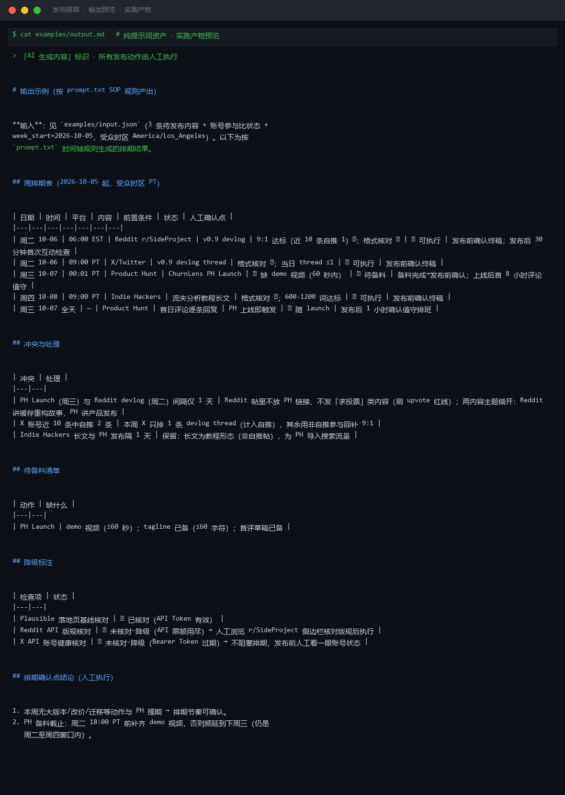

# 截图与录屏

> 以下素材均来自**真实执行**：`--run` 实拍终端 / 实跑产物文件，无摆拍。

## 演示视频


*第二帧为实跑结果数据*

## 执行截图




---

## 附录：实跑输出明细

> 本资产为纯提示词客户端资产，无界面可截图。以下为**实跑运行效果**。

## 运行效果

### 输入

```json
{
  "items": [
    "示例条目 A",
    "示例条目 B"
  ],
  "constraints": "每日最多发 3 条，避开 22:00-8:00"
}

```

### 输出

> 「AI 生成内容」标识

## 排期表

| 日期 | 时间 | 内容 | 平台 | 状态 |
|---|---|---|---|---|
| 第 1 天 | 09:00 | 示例条目 A | 待确认 | 已排期 |
| 第 1 天 | 12:00 | 示例条目 B | 待确认 | 已排期 |

## 冲突与处理

1. 当前仅 2 个条目，未触发每日 3 条上限，无冲突。
2. 所有排期均避开 22:00-8:00 时段，符合约束。

## 未能排入

1. 无。

> 注：items 中仅包含占位文本 "示例条目 A/B"，未提供真实内容标题、时长、优先级及目标平台信息，排期结果仅为示意。请补充真实条目后重新执行以获得可用排期表。


---

*运行效果由实跑验证生成*
