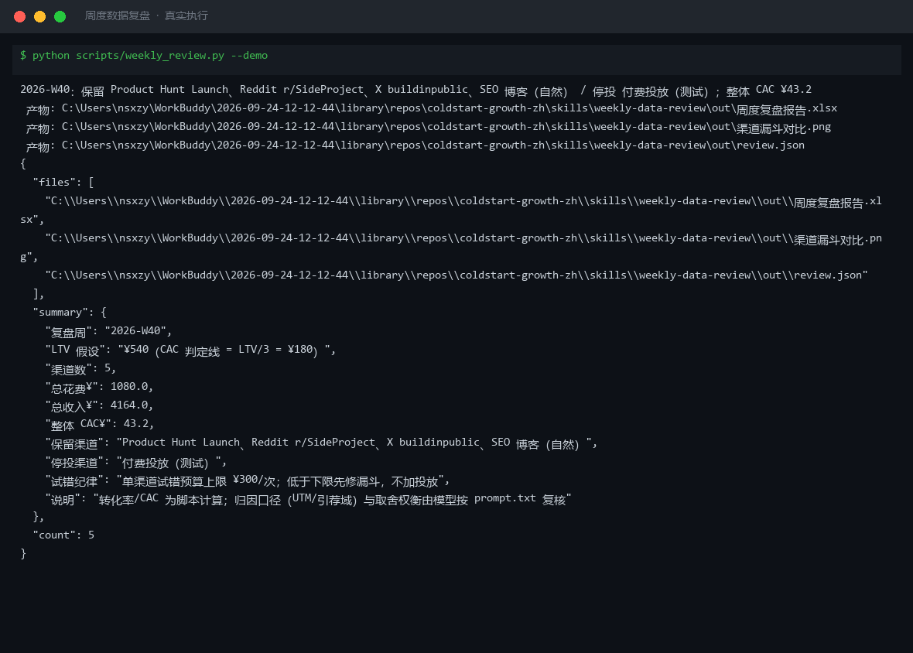
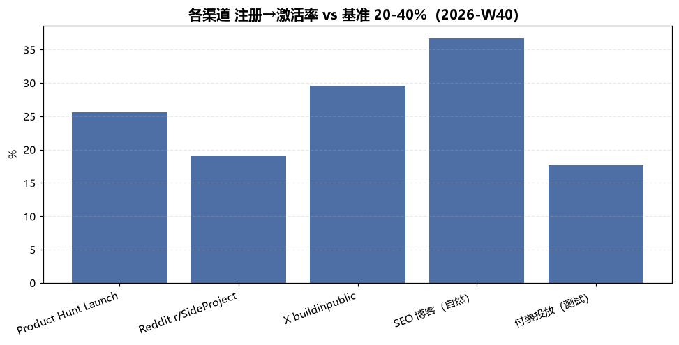
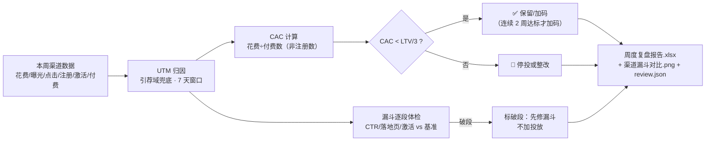

# 周度数据复盘 Weekly Data Review

> 原子技能 ｜ 属于「出海增长官」 ｜ 冷启动期独立开发者（OPC）客群 ｜ T1 产物型（脚本交付真实文件）
>
> **把本周各渠道原始数据算成一张「留/停」决策表：每渠道 CAC、漏斗各级转化率、是否达到 CAC < LTV/3，以及下周行动。**
> 3 段漏斗基准体检（CTR 2-5% / 落地页→注册 8-15% / 注册→激活 20-40%）+ CAC < LTV/3 判定线 + 单渠道试错上限 ¥300/次 · 一次计算输出 Excel 复盘报告与渠道对比图




🎬 **[▶ 观看高清完整版（mp4）](https://cdn.jsdelivr.net/gh/bangwozuo/coldstart-growth-zh@main/skills/weekly-data-review/docs/assets/demo.mp4)** — 四幕数据叙事：业务钩子 → 真实执行 → 指标条形图生长 → 交付物

*上图来自真实执行：2026-W40 复盘 5 渠道（总花费 ¥1,080 / 总收入 ¥4,164），判定保留 4 渠道、停投「付费投放（测试）」（CAC ¥225 ≥ 判定线 ¥180），整体 CAC ¥43.2，产物落盘 Excel + PNG + JSON。*

---

## 它做什么（归因 → 漏斗体检 → 留/停判定）

### 一、归因口径（先定口径，再算数）

| 规则 | 内容 |
|---|---|
| 主口径 | UTM 参数（utm_source/medium/campaign），引荐域兜底；冲突以 UTM 为准并标注冲突条数 |
| 归因窗口 | 默认 7 天点击后转化；跨窗口转化计入来源周——否则爆款周的量会被下周白嫖 |
| 渠道粒度 | sub/内容形态分开算（r/SideProject 帖 ≠ r/SaaS 评论；PH 发布日 ≠ PH 日常） |
| 零散直流量 | 无 UTM 无引荐域单列「直接/未知」，不摊进别的渠道 |

### 二、漏斗基准（出海冷启动通行区间，逐段体检）

| 漏斗段 | 基准 | 低于下限的处理 |
|---|---|---|
| 曝光→点击 CTR | 2–5% | 素材/标题与人群错配，先改内容形态，不加预算 |
| 落地页→注册 | 8–15% | 先修落地页（首屏承诺、加载速度、表单字段数），不加投放 |
| 注册→激活 | 20–40% | 先修 onboarding/激活路径，这是产品问题不是流量问题 |

**纪律：低于下限先修漏斗，不是加投放**——向漏斗破段的渠道加预算，等于往漏水的桶里倒水。高于上限同样要查（CTR > 5% 核实流量真实性，高得反常的数字往往有假）。

### 三、渠道判定（CAC < LTV/3 规则）

- **CAC = 渠道花费 ÷ 付费用户数**（不是注册数——把花费摊到注册上会低估 CAC 3-5 倍）
- **判定线：CAC < LTV/3 → 保留/加码；≥ LTV/3 → 停投或整改**（1/3 给获客留毛利与复购空间）
- 自然渠道 CAC=0 永远保留，但要考核激活率——免费流量把激活率拉垮也在浪费时间
- **试错纪律**：单渠道试错上限 ¥300/次；**连续纪律**：连续 2 周 CAC 达标才能加码
- **样本纪律**：周注册 < 30 的渠道只报值不下「停投」结论（样本不足，再观察 1 周）

## 真实输入 → 真实输出

**输入**（`examples/input.json`）：2026-W40 周数据，LTV ¥540 + 5 个渠道（花费/曝光/点击/注册/激活/付费/收入）。

**输出**（脚本实跑，节选，完整见 [`examples/output.md`](examples/output.md)）：

| 渠道 | 花费¥ | CTR% | 落地页→注册% | 注册→激活% | CAC¥ | ROAS | 判定 |
|---|---|---|---|---|---|---|---|
| Product Hunt Launch | 0 | 6.3 | 16.2 | 25.6 | 0 | — | ✅ 自然渠道：持续投入沉淀为常青内容 |
| X buildinpublic | 60 | 2.0 | 9.0 | 29.6 | 12.0 | 12.42 | ✅ 保留/加码：CAC ¥12 < ¥180 |
| SEO 博客（自然） | 120 | 6.3 ℹ | 13.6 | 36.7 | 20.0 | 9.33 | ✅ 保留/加码：CAC ¥20 < ¥180 |
| 付费投放（测试） | 900 | 3.0 | 6.4 ⚠ | 17.7 ⚠ | 225.0 | 0.36 | 🛑 停投：CAC ¥225 ≥ ¥180 |

**实跑产物**：



- `out/周度复盘报告.xlsx`（渠道明细 / 漏斗体检 / 下周行动 / 汇总，破段与停投行标红）
- `out/渠道漏斗对比.png`（各渠道注册→激活率柱状图，上图）
- `out/review.json`（机器可读结果，供工作流读取）

## 处理流水线



## 快速开始

**方式一：提示词（任意 AI 工具）**

```text
1. 打开 prompt.txt，全文复制
2. 粘贴到 Coze / WorkBuddy / Dify / Claude / ChatGPT
3. 按 schema.json 的输入规格提供：week + ltv + channels（各渠道花费/漏斗数据）
```

**方式二：脚本（零 AI 依赖，确定性计算）**

```bash
# 演示模式（内置真实样例）
python scripts/weekly_review.py --demo
# 指定输入
python scripts/weekly_review.py --input examples/input.json --outdir out
```

依赖：`pip install openpyxl`（缺失时脚本会打印修复命令，不静默失败）。

## 面向谁 / 什么时候用

| ✅ 该用 | ❌ 别用 |
|---|---|
| 每周固定复盘渠道留/停，防无效渠道持续烧钱 | 用整体均值下判断（爆款周会掩盖其他渠道在跌） |
| 投放前检查漏斗是否破段（先修漏斗再花钱） | 替代资金决策（停投/加码必须人工确认后执行） |
| CAC/LTV 健康度体检与下周预算建议 | LTV 口径不明的拍脑袋判定（用 cohort 口径，不拿年收入÷现有用户数） |

## 边界与合规

- 本资产输出为 **AI 辅助生成内容**；停投/加码是**资金决策**，必须人工确认后执行
- 不编造或补齐缺失数据：缺哪列就列清单让用户补，不填默认值
- 每个渠道必须给出保留/整改/停投之一，不给「继续观察」这种无结论输出
- LTV 若为估算值，注明口径（人均收入×平均留存月数），估算偏差会传导到判定线

## 文件地图

```text
├── README.md                  ← 本文件
├── SKILL.md                   ← 资产定义（元信息 / 契约 / 边界）
├── prompt.txt                 ← 提示词本体（归因口径 + 漏斗基准 + CAC 判定线）
├── schema.json                ← 输入输出契约（机器可读）
├── scripts/weekly_review.py   ← 确定性计算脚本（漏斗体检 + CAC 判定 → Excel/PNG/JSON）
├── examples/                  ← 真实输入 + 脚本实跑输出
├── docs/                      ← 9 项配套文档（架构 / 流程 / 场景 / 测试报告…）
└── out/                       ← 实跑产物（周度复盘报告.xlsx / 渠道漏斗对比.png / review.json）
```

---

*本资产遵循 [bangwozuo 数字员工资产规范](https://github.com/bangwozuo/digital-employee-spec) v3.0 ｜ [所属员工：出海增长官](../../) ｜ [总入口](https://github.com/bangwozuo/digital-employees-hub-zh)*
