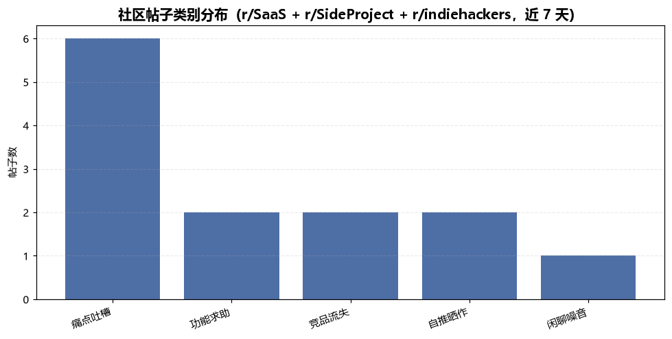
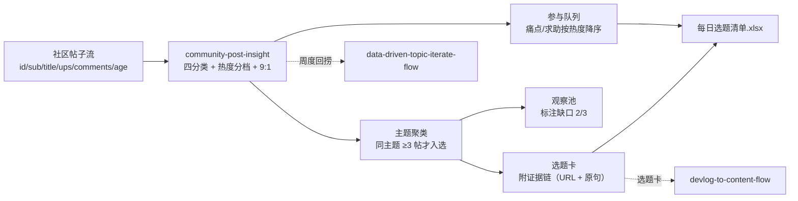

# 每日选题挖掘 Daily Topic Mine Flow

> 复合技能（工作流）｜ 属于「出海增长官」 ｜ 冷启动期独立开发者（OPC）客群 ｜ T3 工作流（可跑编排脚本 + 流程提示词）
>
> **每天 8:00 把社区帖子压成三张清单：选题卡（今天写什么）、观察池（证据不够的主题）、参与队列（今天回哪些帖，9:1 额度核算）。**
> 编排 community-post-insight 实跑 + 主题聚类（同主题 ≥3 帖才入选）+ 9:1 参与队列 · 产物落盘每日选题清单 Excel


🎬 **[▶ 观看演示视频（在线播放）](https://cdn.jsdelivr.net/gh/bangwozuo/coldstart-growth-zh@main/workflows/daily-topic-mine-flow/docs/assets/demo.mp4) · [GitHub 页](https://github.com/bangwozuo/coldstart-growth-zh/blob/main/workflows/daily-topic-mine-flow/docs/assets/demo.mp4)** — 四幕创作叙事：业务钩子 → 真实执行 → 要点到成稿演变 → 交付物

*上图来自真实执行：13 帖四分类为痛点 6 / 求助 2 / 流失 2 / 自推 2 / 噪音 1，产出选题卡 1 张（上手门槛 3 帖达标）、观察池 4 个主题（标注缺口 2/3、1/3）、可参与 8 帖，产物落盘 Excel + JSON。*

---

## 它编排什么（三步链路，每步有失败处理）

| # | 步骤 | 技能资产 | 输入 → 输出 | 失败处理 |
|---|------|---------|------|---------|
| 1 | 四分类 + 热度分档 + 9:1 | [community-post-insight](../../skills/community-post-insight/)（scripts/insight_scan.py 实跑） | 帖子列表 → `out/insight.json` + 热帖洞察清单.xlsx | 退出码≠0 → 全流程中止打印 stderr；空输入 → 占位清单正常退出 |
| 2 | 主题聚类 → 选题卡 / 观察池 | 内置（角度规则引自 [painpoint-sellingpoint-match](../../skills/painpoint-sellingpoint-match/)） | insight.json 的 items → 选题卡 + 观察池（标注缺口） | 分类漏判 → 模型复核存疑项并可反哺词表；**证据链只来自上游，不新增** |
| 3 | 参与队列 + 9:1 核算 | 内置 | insight.json → 参与队列（热度降序）+ 自推额度结论 | 帖龄 >72h 的痛点帖不进队列；9:1 不达标 → 只排非自推参与 |

**量化规则**（引自上游 prompt）：热度分 = 点赞 + 2×评论数（≤24h ×1.2 / ≤72h ×1.0 / 更早 ×0.8，≥200 🔥 / 50-200 🌤 / <50 ❄）；七主题聚类（定价/上手门槛/集成导出/性能/隐私安全/移动端/协作），**同主题 7 天窗口 ≥3 帖才入选选题卡**。

## 真实输入 → 真实输出

**输入**（`examples/input.json`）：13 条帖子（r/SaaS + r/SideProject + r/indiehackers，窗口 7 天）。

**输出**（脚本实跑，节选，完整见 [`examples/output.md`](examples/output.md)）：

| 主题 | 证据帖数 | 证据链 | 建议角度 | 下一步 |
|---|---|---|---|---|
| 上手门槛 | 3（≥3 ✅） | P005 r/SaaS（热度 120.0）· P013 r/SaaS（119.0）· P014 r/indiehackers（102.0），各含 URL | 痛点瞬间角度：抓配置/接入卡住的具体时刻 | 交 painpoint-sellingpoint-match 生成钩子 |

| 主题 | 缺口 | 证据帖 | 结论 |
|---|---|---|---|
| 定价 | 2/3 | P007（463.2）、P012（129.0） | 还差 1 条证据；连续 2 周不足则放弃 |
| 隐私安全 | 1/3 | P009（247.0） | 观察 |

**实跑产物**：



- `out/每日选题清单.xlsx`（选题卡 / 观察池 / 参与队列）
- `out/帖子类别分布.png`（四类别占比柱状图，上图）
- `out/topic_mine_result.json` + `out/insight.json`（机器可读，供下游工作流读取）

## 处理流水线（DAG）



## 快速开始

**提示词方式（任意 AI 工具）**

```text
1. 打开 prompt.txt，全文复制
2. 粘贴到 Coze / WorkBuddy / Dify / Claude / ChatGPT
3. 按 schema.json 的输入规格提供：source + posts（帖子列表）
```

**脚本方式（零 AI 依赖，确定性编排）**

```bash
# 演示模式（内置真实样例）
python scripts/run_flow.py --demo
# 指定输入
python scripts/run_flow.py --input examples/input.json --outdir out
```

触发方式：定时（每日 8:00）。选题卡交给 painpoint-sellingpoint-match 生成钩子，发帖动作由人工执行。

## 面向谁 / 什么时候用

| ✅ 该用 | ❌ 别用 |
|---|---|
| 每天固定时段跑一遍，产出当日三张清单 | 代替模型语境复核（词表分类分不出反讽与黑话） |
| 想要「单帖不成选题」的纪律（≥3 帖才写） | 抓取需登录的私域数据（只走官方 API 或人工粘贴） |
| 9:1 参与额度核算，防账号被限 | 自动发帖/刷量（发帖动作永远人工执行） |

## 边界与合规

- 本工作流输出为 **AI 辅助生成内容**；发帖/评论前人工确认 sub 版规原文（每月可能更新）
- 所有对外发言**披露开发者身份**；不刷 upvote、不用小号互推
- 选题证据链只来自上游洞察产物，**不新增不编造**；来源拿不到就列缺失清单
- 上游脚本产物缺失/损坏 → 中止并提示重跑上游，不静默跳过

## 文件地图

```text
├── README.md                  ← 本文件
├── SKILL.md                   ← 工作流定义（编排 DAG / 步骤明细 / 契约）
├── prompt.txt                 ← 流程提示词本体
├── schema.json                ← 输入输出契约（机器可读）
├── scripts/run_flow.py        ← 编排脚本（调 insight_scan.py + 聚类 + 队列）
├── examples/                  ← 真实输入 + 实跑输出
├── docs/                      ← 9 项配套文档（架构 / 流程 / 场景 / 测试报告…）
└── out/                       ← 实跑产物（每日选题清单.xlsx / 帖子类别分布.png / insight.json）
```

---

*本资产遵循 [bangwozuo 数字员工资产规范](https://github.com/bangwozuo/digital-employee-spec) v3.0 ｜ [所属员工：出海增长官](../../) ｜ [总入口](https://github.com/bangwozuo/digital-employees-hub-zh)*
