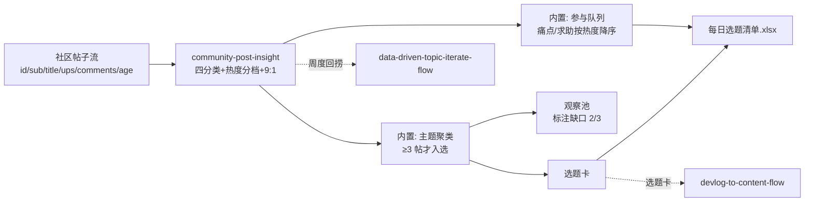

# 每日选题挖掘

每天 8:00 把社区帖子压成三张清单：**选题卡**（今天写什么）、**观察池**
（证据不够的主题）、**参与队列**（今天回哪些帖，9:1 额度核算）。
选题卡交给 painpoint-sellingpoint-match 生成钩子，发帖动作由人工执行。

## 元信息

| 字段 | 值 |
|------|-----|
| ID | `de_dev_01_wf01` |
| 类型 | **`composite`（复合技能/工作流）** |
| 所属员工 | 出海增长官 |
| 阶段 | `P0` |
| 复杂度 | `M` |
| 触发方式 | 定时（每日 8:00） |
| ROI | 省 0.5h/日 × 30 × ¥80 ≈ ¥1200/月 |
| 资产形态 | 可跑编排脚本 + 深度流程提示词（无模型调用依赖、无 API Key） |

## 编排的原子技能

| # | 原子技能 | 能力 |
|---|---------|------|
| 1 | [社区热帖洞察](../../skills/community-post-insight/) | 四分类+热度分档+9:1 额度核算（scripts/insight_scan.py） |
| 2 | [痛点卖点匹配](../../skills/painpoint-sellingpoint-match/) | 选题卡的建议角度按其五角度规则映射（T2 提示词，编排层面引用规则） |

## 步骤链路（DAG）



## 步骤明细

| # | 步骤 | 技能资产 | 输入 | 输出 | 失败处理 |
|---|------|---------|------|------|---------|
| 1 | 四分类+热度分档 | `community-post-insight` | 帖子列表（官方 API/人工粘贴） | `out/insight.json` + 热帖洞察清单.xlsx | 退出码≠0 → 全流程中止打印 stderr；产物缺失 → 中止提示重跑；空输入 → 占位清单正常退出 |
| 2 | 主题聚类→选题卡/观察池 | 内置（角度规则引自 `painpoint-sellingpoint-match`） | `out/insight.json` 的 items | 选题卡 + 观察池（标注缺口） | 分类漏判 → 模型复核存疑项并可反哺词表；证据链只来自上游，不新增 |
| 3 | 参与队列 + 9:1 核算 | 内置 | `out/insight.json` | 参与队列（热度降序）+ 自推额度结论 | 帖龄 >72h 的痛点帖不进队列；9:1 不达标 → 只排非自推参与 |

## 输入规格

| 字段 | 类型 | 必填 | 说明 |
|------|------|------|------|
| `source` / `window_days` | string / number | ⬜ | 来源标注与时间窗口（默认 7 天） |
| `posts` | array | ✅ | 帖子列表：id/subreddit/title/ups/num_comments/age_hours/url |

## 输出规格

| 字段 | 类型 | 说明 |
|------|------|------|
| `topic_cards` | array | 入选选题（同主题 ≥3 帖，含证据链与建议角度） |
| `watchlist` | array | 观察池（缺口标注，连续 2 周不足则放弃） |
| `join_queue` | array | 参与队列（痛点/求助帖按热度降序） |
| `deliverable` | file | `out/每日选题清单.xlsx`（选题卡+观察池+参与队列+汇总） |

## 错误处理

| 情况 | 处理方式 |
|------|---------|
| 上游脚本退出码 ≠0 | 全流程中止，打印 stderr（不静默失败） |
| insight.json 缺失/损坏 | 中止并提示重跑上游步骤 |
| 帖子为空 | 「今日无目标帖」占位清单正常退出，不算失败 |
| 分类漏判（词表外表达） | 模型语境复核存疑项；结论反哺上游词表并回归测试 |
| 主题证据不足 3 帖 | 不判选题，进观察池标注缺口 |

## 使用步骤

### 方式一：跑脚本（端到端，产出真实清单）

```bash
python3 <FLOW_DIR>/scripts/run_flow.py --input input.json --outdir out
python3 <FLOW_DIR>/scripts/run_flow.py --demo      # 无输入看效果
```

### 方式二：手动编排（任意 AI 平台）

1. 把 community-post-insight 的 prompt.txt 作为系统提示词，输入当日帖子 → 得分类与热度
2. 按七主题归堆，≥3 帖的主题生成选题卡（带证据链），其余进观察池
3. 痛点/求助帖按热度降序排参与队列，按 9:1 核算今日自推额度

## 验收标准

- [x] 每步技能资产齐全且真实存在（insight_scan.py 可跑）
- [x] 步骤间以 JSON 文件衔接（insight.json items → 选题卡/参与队列）
- [x] 末步产物带 AI 生成标识
- [x] 全流程人工确认环节（发帖/参与由人工执行）

## 边界（不做的事）

- ❌ 不编造帖子、热度或证据链；上游没给的证据不出现在选题卡里
- ❌ 不跳过上游脚本直接猜分类与热度——数值以脚本输出为准
- ❌ 不写成品正文；不自动发帖
- ❌ 单帖不成选题；不足 3 帖进观察池

## 调用示例

**输入**（`examples/input.json`，节选）：

```json
{
  "source": "r/SaaS + r/SideProject + r/indiehackers",
  "window_days": 7,
  "posts": [
    {"id": "P013", "subreddit": "r/SaaS", "title": "Setup wizard is too confusing - 40% drop off at step 2 of onboarding", "ups": 65, "num_comments": 27, "age_hours": 40}
  ]
}
```

**输出**（run_flow.py 实跑，退出码 0）：13 帖 → 入选选题 1（「上手门槛」3 帖：
P005/P013/P014，总热度 341.0）、观察池 4（定价 2/3、隐私安全 1/3、性能 1/3、
移动端 1/3）、可参与 8 帖。详见 examples/output.md。

## 所属工作流

本资产为独立端到端流程；选题卡流向 `devlog-to-content-flow` 与
`one-draft-multi-platform-flow`；周度表现回捞接 `data-driven-topic-iterate-flow`。

## 合规声明

- 本流程产出为 **AI 辅助选题清单**，发帖/评论由人工执行并按平台要求标注 AI 生成内容
- 参与队列遵守 9:1 参与比；不刷 upvote、不伪装用户口吻、披露开发者身份
- 帖子数据仅限本账号运营分析使用

---

*本技能遵循 [bangwozuo 数字员工资产规范](https://github.com/bangwozuo/digital-employee-spec) v3.0*
