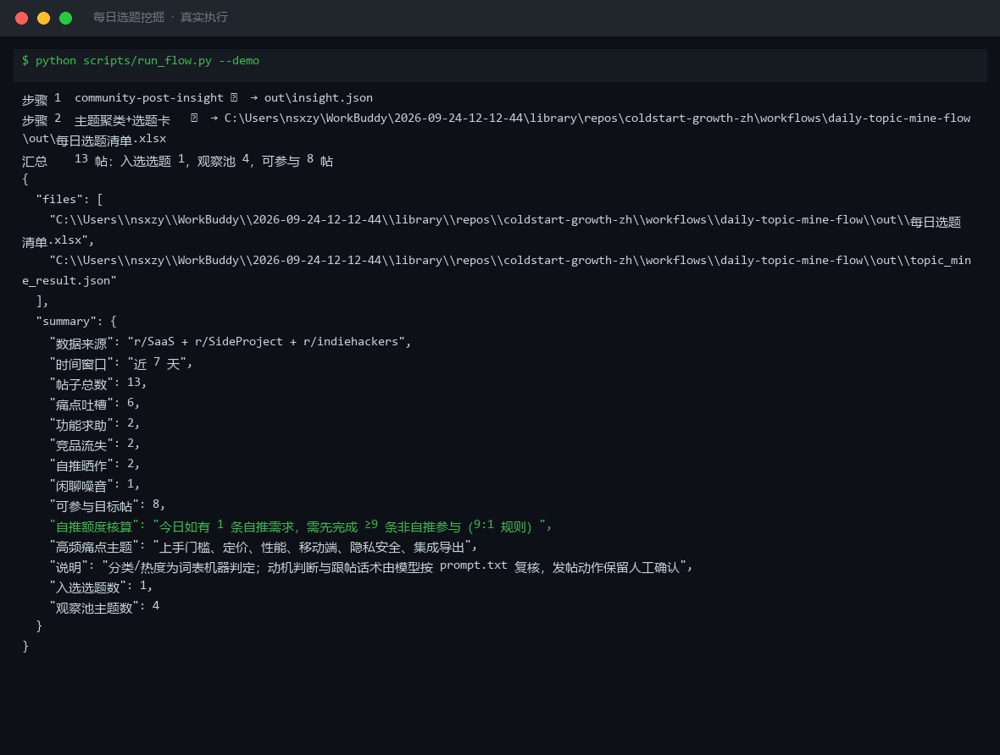

# 截图与录屏

> 以下素材均来自**真实执行**：`--run` 实拍终端 / 实跑产物文件，无摆拍。

## 演示视频


*四幕创作叙事（Hyperframes 动态渲染 19s）：业务钩子 → 真实执行 → 输入要点到成稿演变 → 交付物*

## 执行截图



## 实跑产物

| 文件 | 说明 |
|---|---|
| [`out/_demo_input.json`](out/_demo_input.json) | 结构化结果（实跑生成） · 4 KB |
| [`out/insight.json`](out/insight.json) | 结构化结果（实跑生成） · 8 KB |
| [`out/topic_mine_result.json`](out/topic_mine_result.json) | 结构化结果（实跑生成） · 6 KB |
| [`out/帖子类别分布.png`](out/帖子类别分布.png) | 图表产物（实跑生成） · 31 KB |
| [`out/每日选题清单.xlsx`](out/每日选题清单.xlsx) | Excel 工作簿（实跑生成） · 9 KB |
| [`out/热帖洞察清单.xlsx`](out/热帖洞察清单.xlsx) | Excel 工作簿（实跑生成） · 10 KB |


---

## 附录：实跑输出明细

> 本资产为纯提示词客户端资产，无界面可截图。以下为**实跑运行效果**。

## 运行效果

### 输入

```json
{
  "input": "请提供工作流的初始输入数据"
}

```

### 输出

> 「AI 生成内容」标识

## 执行摘要

工作流因缺少初始输入数据而暂停，未进入任何原子技能执行步骤。

## 分步结果

1. 步骤 1（社区热帖洞察）：未执行 — 缺少 `source` 与 `scope` 输入。
2. 步骤 2（痛点卖点匹配）：未执行 — 上一步无输出。

## 最终交付物

（无）

> 依据工作原则第 3 条：上一步输出不完整时，先提示补充，不强行继续。请提供包含 `source`（数据来源）和 `scope`（采集范围）的初始输入后重新执行本工作流。


---

*运行效果由实跑验证生成*
