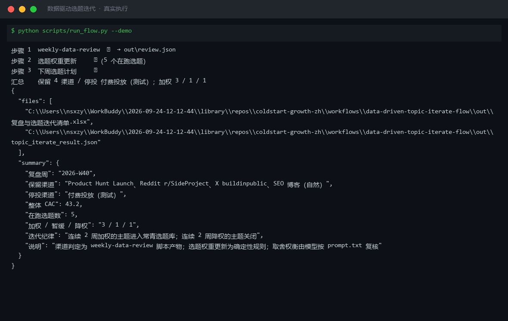
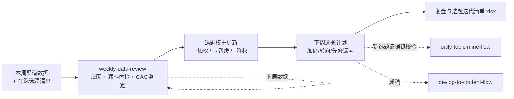

# 数据驱动选题迭代 Data Driven Topic Iterate Flow

> 复合技能（工作流）｜ 属于「出海增长官」 ｜ 冷启动期独立开发者（OPC）客群 ｜ T3 工作流（可跑编排脚本 + 流程提示词）
>
> **每周日把「本周数据」变成「下周选题计划」：渠道先做留/停判定，在跑选题按渠道判定加权/暂缓/降权，新选题必须先过证据链校验。单周波动不改权重。**
> 编排 weekly-data-review 实跑（CAC < LTV/3 判定）+ 确定性选题权重更新（周注册 <30 判定降级）+ 下周计划衔接 · 产物落盘复盘与选题迭代清单 Excel




*上图来自真实执行：2026-W40 复盘判定保留 4 渠道 / 停投「付费投放（测试）」，5 个在跑选题更新为加权 3 / 暂缓 1 / 降权 1，整体 CAC ¥43.2，产物落盘 Excel + JSON。*

---

## 它编排什么（三步链路，每步有失败处理）

| # | 步骤 | 技能资产 | 输入 → 输出 | 失败处理 |
|---|------|---------|------|---------|
| 1 | 渠道归因 + 漏斗体检 + CAC 判定 | [weekly-data-review](../../skills/weekly-data-review/)（scripts/weekly_review.py 实跑） | week/ltv/channels → `out/review.json` + 周度复盘报告.xlsx | 退出码≠0 → 全流程中止打印 stderr；ltv 缺失 → 上游拒绝执行；review.json 缺失 → 中止提示重跑 |
| 2 | 选题权重更新 | 内置（确定性规则） | review.json + active_topics → 权重表（↑/→/↓） | 在跑选题为空 → 占位清单正常退出 |
| 3 | 下周选题计划 | 内置 | 权重表 → 加倍/转向/先修漏斗动作 + 工作流衔接 | 无加权主题 → 计划页**如实写「本周无可加权选题」**，提示跑 daily-topic-mine-flow 挖新题 |

**确定性权重规则**：渠道判保留/加码 → 选题 ↑ 加权（系列化）；渠道漏斗破段 → → 暂缓（先修漏斗，选题照跑预算不加）；渠道判停投 → ↓ 降权（素材迁移到保留渠道重写，连续 2 周降权则关闭）。**周注册 <30 判定降级为参考**（样本不足），连续 2 周加权的主题进常青选题库。

## 真实输入 → 真实输出

**输入**（`examples/input.json`）：2026-W40 五渠道数据 + 5 个在跑选题清单。

**输出**（脚本实跑，节选，完整见 [`examples/output.md`](examples/output.md)）：

| 选题 | 渠道 | 本周注册 | 渠道判定 | 权重 | 依据 |
|---|---|---|---|---|---|
| churn 分析实战（PH 配套） | Product Hunt Launch | 82 | ✅ 自然渠道 | ↑ 加权 | 系列化：拆成 2-3 个子题连载 |
| 缓存重构 devlog 系列 | X buildinpublic | 54 | ✅ 保留/加码（CAC ¥12） | ↑ 加权 | 连续 2 周加权进常青选题库 |
| webhook 配置踩坑帖 | Reddit r/SideProject | 21 | ✅ 自然渠道（漏斗双破段） | → 暂缓 | 先修漏斗（落地页→注册 7.0% 破基准）；周注册 <30，样本不足降级为参考 |
| 付费投放素材组 A/B | 付费投放（测试） | 96 | 🛑 停投 | ↓ 降权 | 渠道判停投，素材组迁移到保留渠道重写 |

**实跑产物**：


- `out/复盘与选题迭代清单.xlsx`（渠道复盘 / 权重更新 / 下周计划）
- `out/渠道漏斗对比.png`（各渠道注册→激活率柱状图，上图）
- `out/topic_iterate_result.json` + `out/review.json`（机器可读，供下游工作流读取）

## 处理流水线（DAG）



## 快速开始

**提示词方式（任意 AI 工具）**

```text
1. 打开 prompt.txt，全文复制
2. 粘贴到 Coze / WorkBuddy / Dify / Claude / ChatGPT
3. 按 schema.json 的输入规格提供：week + ltv + channels + active_topics
```

**脚本方式（零 AI 依赖，确定性编排）**

```bash
# 演示模式（内置真实样例）
python scripts/run_flow.py --demo
# 指定输入
python scripts/run_flow.py --input examples/input.json --outdir out
```

触发方式：定时（每周日）。停投/加码是资金决策，**建议输出后必须人工确认**。

## 面向谁 / 什么时候用

| ✅ 该用 | ❌ 别用 |
|---|---|
| 每周复盘后决定下周选题加倍/转向/砍掉 | 单周波动就改权重（连续 2 周达标才加码，连续 2 周降权才关闭） |
| 在跑选题与渠道健康度联动（渠道破段先修漏斗） | 跳过证据链直接上新选题（新选题先过 daily-topic-mine-flow 校验 ≥3 帖） |
| 防止无效选题持续消耗写作时间 | 替代资金决策（停投/加码建议必须人工确认） |

## 边界与合规

- 本工作流输出为 **AI 辅助生成内容**；渠道停投/加码是**资金决策**，必须人工确认后执行
- 选题权重更新为确定性规则（可复算复核），取舍权衡由模型按 prompt.txt 复核
- 无加权主题时计划页如实写「本周无可加权选题」，不硬凑计划
- 上游 review.json 缺失/损坏 → 中止提示重跑上游，不静默跳过

## 文件地图

```text
├── README.md                  ← 本文件
├── SKILL.md                   ← 工作流定义（编排 DAG / 步骤明细 / 契约）
├── prompt.txt                 ← 流程提示词本体
├── schema.json                ← 输入输出契约（机器可读）
├── scripts/run_flow.py        ← 编排脚本（调 weekly_review.py + 权重更新 + 计划）
├── examples/                  ← 真实输入 + 实跑输出
├── docs/                      ← 9 项配套文档（架构 / 流程 / 场景 / 测试报告…）
└── out/                       ← 实跑产物（复盘与选题迭代清单.xlsx / 渠道漏斗对比.png / review.json）
```

---

*本资产遵循 [bangwozuo 数字员工资产规范](https://github.com/bangwozuo/digital-employee-spec) v3.0 ｜ [所属员工：出海增长官](../../) ｜ [总入口](https://github.com/bangwozuo/digital-employees-hub-zh)*
