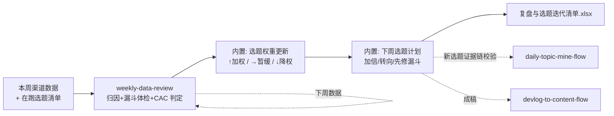

# 数据驱动选题迭代

每周日把「本周数据」变成「下周选题计划」：渠道先做留/停判定，在跑选题按
渠道判定加权/暂缓/降权，新选题必须先过证据链校验。单周波动不改权重。

## 元信息

| 字段 | 值 |
|------|-----|
| ID | `de_dev_01_wf05` |
| 类型 | **`composite`（复合技能/工作流）** |
| 所属员工 | 出海增长官 |
| 阶段 | `P1` |
| 复杂度 | `M` |
| 触发方式 | 定时（每周日） |
| ROI | 决策提质，间接 ROI（防止无效选题持续消耗写作时间） |
| 资产形态 | 可跑编排脚本 + 深度流程提示词（无模型调用依赖、无 API Key） |

## 编排的原子技能

| # | 原子技能 | 能力 |
|---|---------|------|
| 1 | [周度数据复盘](../../skills/weekly-data-review/) | 渠道归因+漏斗体检+CAC<LTV/3 判定（scripts/weekly_review.py） |

## 步骤链路（DAG）



## 步骤明细

| # | 步骤 | 技能资产 | 输入 | 输出 | 失败处理 |
|---|------|---------|------|------|---------|
| 1 | 渠道归因+漏斗体检+CAC 判定 | `weekly-data-review`（scripts/weekly_review.py） | week/ltv/channels | `out/review.json` + 周度复盘报告.xlsx | 退出码≠0 → 全流程中止打印 stderr；ltv 缺失 → 上游拒绝执行；review.json 缺失 → 中止提示重跑 |
| 2 | 选题权重更新 | 内置（确定性规则） | review.json + active_topics | 权重表（↑/→/↓，周注册<30 判定降级） | 在跑选题为空 → 占位清单正常退出 |
| 3 | 下周选题计划 | 内置 | 权重表 | 加倍/转向/先修漏斗动作 + 工作流衔接 | 无加权主题 → 计划页如实写「本周无可加权选题」，提示跑 daily-topic-mine-flow 挖新题 |

## 输入规格

| 字段 | 类型 | 必填 | 说明 |
|------|------|------|------|
| `week` / `ltv` | string / number | ✅ | 复盘周与 LTV（估算须注明口径） |
| `channels` | array | ✅ | 渠道数据（name/spend/impressions/clicks/signups/activated/paying/revenue） |
| `active_topics` | array | ⬜ | 在跑选题：topic / channel / week_signups |

## 输出规格

| 字段 | 类型 | 说明 |
|------|------|------|
| `weights` | array | 选题权重更新（↑ 加权 / → 暂缓 / ↓ 降权，附依据） |
| `plan` | array | 下周选题计划（动作 + 与 daily-topic-mine-flow / devlog-to-content-flow 的衔接） |
| `deliverable` | file | `out/复盘与选题迭代清单.xlsx`（渠道判定+权重更新+下周计划+汇总） |

## 错误处理

| 情况 | 处理方式 |
|------|---------|
| 上游脚本退出码 ≠0 | 全流程中止，打印 stderr（不静默失败） |
| review.json 缺失/损坏 | 中止并提示重跑上游步骤 |
| ltv 缺失 | 上游拒绝执行（CAC 判定无法进行），流程中止 |
| 在跑选题为空 | 占位清单正常退出，提示先跑选题挖掘 |
| 周注册 <30 | 判定降级为「参考」，不下停投/加倍结论 |

## 使用步骤

### 方式一：跑脚本（端到端，真实 Excel）

```bash
python3 <FLOW_DIR>/scripts/run_flow.py --input input.json --outdir out
python3 <FLOW_DIR>/scripts/run_flow.py --demo      # 无输入看效果
```

### 方式二：手动编排（任意 AI 平台）

1. 先跑 weekly-data-review（或用其 prompt 手工复盘）得到渠道判定
2. 把本工作流 prompt.txt 作为系统提示词，按权重规则逐选题更新
3. 下周计划交 daily-topic-mine-flow 校验证据链后进入成稿

## 验收标准

- [x] 每步技能资产齐全且真实存在（weekly_review.py 可跑）
- [x] 步骤间以 JSON 文件衔接（review.json channels → 权重更新）
- [x] 末步产物带 AI 生成标识
- [x] 资金决策（停投/加码）与选题取舍均保留人工确认环节

## 边界（不做的事）

- ❌ 不编造或补齐数据；数值以脚本输出为准
- ❌ 不凭感觉改权重——只认渠道判定与样本量两条规则
- ❌ 不给停投渠道追加预算；不追单周波动（连续 2 周同向才改权重）
- ❌ 不跳过证据链校验直接进新选题

## 调用示例

**输入**（`examples/input.json`，节选）：

```json
{
  "week": "2026-W40",
  "ltv": 540,
  "channels": [{"name": "付费投放（测试）", "spend": 900, "paying": 4}],
  "active_topics": [
    {"topic": "churn 分析实战（PH 发布配套）", "channel": "Product Hunt Launch", "week_signups": 82},
    {"topic": "付费投放素材组 A/B", "channel": "付费投放（测试）", "week_signups": 96}
  ]
}
```

**输出**（run_flow.py 实跑，退出码 0）：5 个在跑选题 → 加权 3（PH/X/SEO，
系列化拆子题）、暂缓 1（Reddit 漏斗破段，先修落地页）、降权 1（付费投放
停投，选题转向保留渠道）；周注册 <30 的选题全部标注样本不足。
详见 examples/output.md。

## 所属工作流

上游接 `publish-schedule-flow`（本周动作的执行数据）；下游把新选题交回
`daily-topic-mine-flow` 校验证据链，形成「选题→内容→发布→复盘→选题」闭环。

## 合规声明

- 本流程产出为 **AI 辅助迭代计划**，选题取舍与资金决策由人工确认
- 数据仅限本账号运营使用； traction 数据不造假，复盘结论如实记录失败主题
- 数值以 weekly-data-review 脚本输出为准，本流程不重算

---

*本技能遵循 [bangwozuo 数字员工资产规范](https://github.com/bangwozuo/digital-employee-spec) v3.0*
