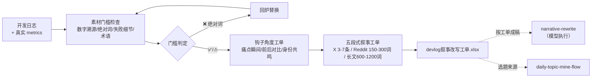

# 开发日志转内容 Devlog To Content Flow

> 复合技能（工作流）｜ 属于「出海增长官」 ｜ 冷启动期独立开发者（OPC）客群 ｜ T3 工作流（可跑编排脚本 + 流程提示词）
>
> **把一篇开发日志变成「可直接动笔的改写工单」：门槛检查过了、钩子角度定了、每个平台的五段式骨架和字数上限排好了。**
> 6 项素材门槛检查（数字溯源/绝对词/失败细节/术语清单）+ 3 种钩子角度工单 + 3 平台 × 5 要素叙事工单 · 产物落盘改写工单 Excel


🎬 **[▶ 观看高清完整版（mp4）](https://cdn.jsdelivr.net/gh/bangwozuo/coldstart-growth-zh@main/workflows/devlog-to-content-flow/docs/assets/demo.mp4)** — 四幕创作叙事：业务钩子 → 真实执行 → 要点到成稿演变 → 交付物

*上图来自真实执行：devlog 通过 6 项门槛检查（绝对词 0 处、失败细节保留）、钩子角度工单 3 角度、五段式叙事工单 3 平台 × 5 要素，结论「✅ 可成稿」，产物落盘 Excel + JSON。*

---

## 它编排什么（三步链路，每步有失败处理）

| # | 步骤 | 技能资产 | 输入 → 输出 | 失败处理 |
|---|------|---------|------|---------|
| 1 | 素材门槛检查 | 内置（规则引自 [narrative-rewrite](../../skills/narrative-rewrite/) 数据诚实条款） | devlog + metrics → 检查清单（数字溯源/绝对词/失败细节/术语） | devlog 空 → 中止不编造；metrics 缺 → 标「数字待溯源」不中止；**绝对词 → 判回炉** |
| 2 | 钩子角度工单 | 内置（引自 [painpoint-sellingpoint-match](../../skills/painpoint-sellingpoint-match/) 五角度规则） | 检查清单 → 3 种钩子角度 + 用法 | 角度缺素材支撑 → 如实标注，不硬凑 |
| 3 | 五段式叙事工单 | 内置（引自 narrative-rewrite 平台形态参数） | → 每平台五段式骨架 + 字数上限 | — |

**门槛检查 6 项**：数字逐个溯源（8s / 2.1s / 20 分钟各自登记）、绝对化用语扫描、失败细节有无（build-in-public 的交换物）、术语清单（供视角转换，成稿非必要术语 ≤2 个/百字）。

## 真实输入 → 真实输出

**输入**（`examples/input.json`）：一篇缓存重构 devlog + 真实 metrics（8s→2.1s / 47 用户 / MRR ¥312）。

**输出**（脚本实跑，节选，完整见 [`examples/output.md`](examples/output.md)）：

| 检查项 | 结果 | 处理 |
|---|---|---|
| 数字溯源：8s / 2.1s / 20 分钟 | ✅ 来自日志原文 | 可用，发布时原样报，**不换算**（禁止写成「快 4 倍」） |
| 绝对化用语扫描 | ✅ 未命中 | — |
| 失败细节 | ✅ 有（缓存击穿事故） | 保留进成稿 |
| 术语清单 | DB、Redis、Webhook、缓存、队列 | 成稿每个术语须带用户侧后果 |

| 角度 | 怎么用（结合本日志） |
|---|---|
| 痛点瞬间 | 「周四凌晨缓存击穿、DB 打满」是本日志最狼狈的时刻，可做开头 |
| 前后对比 | 8s → 2.1s 原样报 |
| 身份共鸣 | 「独立开发者也要自己扛线上事故」的处境共鸣 |

**实跑产物**：`out/devlog叙事改写工单.xlsx`（门槛检查 / 钩子角度 / 叙事工单）+ `out/devlog_flow_result.json`（机器可读）。

## 处理流水线（DAG）



## 快速开始

**提示词方式（任意 AI 工具）**

```text
1. 打开 prompt.txt，全文复制
2. 粘贴到 Coze / WorkBuddy / Dify / Claude / ChatGPT
3. 按 schema.json 的输入规格提供：devlog 原文 + metrics + 目标平台
```

**脚本方式（零 AI 依赖，确定性编排）**

```bash
# 演示模式（内置真实样例）
python scripts/run_flow.py --demo
# 指定输入
python scripts/run_flow.py --input examples/input.json --outdir out
```

触发方式：人工（提交 commit 摘要/日志）。工单交给模型按 narrative-rewrite 成稿，**人工确认后发布**。

## 面向谁 / 什么时候用

| ✅ 该用 | ❌ 别用 |
|---|---|
| devlog 写完想发 build-in-public，先过素材门槛 | 数字无法溯源硬发（metrics 缺失标「待溯源」，不编造） |
| 想要每平台字数上限与五段式骨架排好的工单 | 代替模型成稿（工单是确定性规则产出，成稿由模型完成） |
| 失败细节保留（真实叙事换有质量的回复） | 绝对词回炉偷懒跳过（命中即判回炉，不静默放行） |

## 边界与合规

- 本工作流输出为 **AI 辅助生成内容**（工单），成稿与发布前必须**人工确认**
- 成稿数字只能用工单登记项；**没有的数字不写，traction 造假 = 社区永久拉黑**
- 开发者身份披露；不在禁止自推的 sub 版本放产品链接
- 绝对化用语命中即回炉，不做「降级保留」

## 文件地图

```text
├── README.md                  ← 本文件
├── SKILL.md                   ← 工作流定义（编排 DAG / 步骤明细 / 契约）
├── prompt.txt                 ← 流程提示词本体
├── schema.json                ← 输入输出契约（机器可读）
├── scripts/run_flow.py        ← 编排脚本（门槛检查 + 钩子工单 + 叙事工单）
├── examples/                  ← 真实输入 + 实跑输出
├── docs/                      ← 9 项配套文档（架构 / 流程 / 场景 / 测试报告…）
└── out/                       ← 实跑产物（devlog叙事改写工单.xlsx / devlog_flow_result.json）
```

---

*本资产遵循 [bangwozuo 数字员工资产规范](https://github.com/bangwozuo/digital-employee-spec) v3.0 ｜ [所属员工：出海增长官](../../) ｜ [总入口](https://github.com/bangwozuo/digital-employees-hub-zh)*
