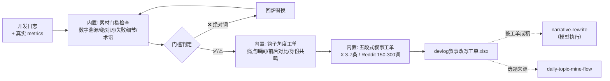

# 开发日志转内容

把一篇开发日志变成「可直接动笔的改写工单」：门槛检查过了、钩子角度定了、
每个平台的五段式骨架和字数上限排好了。工单交给模型成稿，人工确认后发布。

## 元信息

| 字段 | 值 |
|------|-----|
| ID | `de_dev_01_wf02` |
| 类型 | **`composite`（复合技能/工作流）** |
| 所属员工 | 出海增长官 |
| 阶段 | `P0` |
| 复杂度 | `S` |
| 触发方式 | 人工（提交 commit 摘要/日志） |
| ROI | 省 0.8h/日 ≈ ¥1900/月 |
| 资产形态 | 可跑编排脚本 + 深度流程提示词（无模型调用依赖、无 API Key） |

## 编排的原子技能

| # | 原子技能 | 能力 |
|---|---------|------|
| 1 | [痛点卖点匹配](../../skills/painpoint-sellingpoint-match/) | 钩子角度工单按其五角度规则生成（T2 提示词，编排层面引用规则） |
| 2 | [叙事改写](../../skills/narrative-rewrite/) | 五段式骨架与平台形态上限按其方法论展开（T2 提示词） |

## 步骤链路（DAG）



## 步骤明细

| # | 步骤 | 技能资产 | 输入 | 输出 | 失败处理 |
|---|------|---------|------|------|---------|
| 1 | 素材门槛检查 | 内置（规则引自 `narrative-rewrite` 数据诚实条款） | devlog + metrics | 检查清单（数字溯源/绝对词/失败细节/术语） | devlog 空 → 中止不编造；metrics 缺 → 标「数字待溯源」不中止；绝对词 → 判回炉 |
| 2 | 钩子角度工单 | 内置（引自 `painpoint-sellingpoint-match`） | 门槛检查通过后的日志 | 三角度用法说明 | 钩子无具体细节 → 退回步骤 1 补素材 |
| 3 | 五段式叙事工单 | 内置（引自 `narrative-rewrite`） | 角度工单 + 平台列表 | 逐平台骨架（5 要素 × 字数上限） | 平台未识别 → 按 Reddit 规格兜底并标注 |
| 4 | 按工单成稿 | （模型执行 `narrative-rewrite` prompt） | 工单 | 成稿 + 约束核对 | 成稿数字超出工单登记 → 核对不通过，人工拦截 |

## 输入规格

| 字段 | 类型 | 必填 | 说明 |
|------|------|------|------|
| `devlog` | string | ✅ | 开发日志原文（技术视角） |
| `metrics` | object | ⬜ | 本周真实数据（用户数/MRR/星标），仅这些数字可出现在成稿 |
| `platforms` | array | ⬜ | 目标平台（X/Twitter、Reddit r/SideProject、Indie Hackers、dev.to） |

## 输出规格

| 字段 | 类型 | 说明 |
|------|------|------|
| `checks` | array | 门槛检查明细（数字溯源/绝对词/失败细节/术语清单） |
| `angles` | array | 钩子角度工单 |
| `platform_specs` | array | 逐平台五段式骨架与上限 |
| `deliverable` | file | `out/devlog叙事改写工单.xlsx`（门槛检查+角度+骨架+汇总） |

## 错误处理

| 情况 | 处理方式 |
|------|---------|
| devlog 为空 | 流程中止，提示提供日志原文（不编造） |
| 日志含绝对化用语 | 工单结论「❌ 回炉」，列出命中词 |
| metrics 缺失 | 不中止；工单标注「数字待溯源」，成稿不得新增数字 |
| 成稿数字超登记 | 约束核对不通过，人工拦截后再发布 |

## 使用步骤

### 方式一：跑脚本（产出工单，真实 Excel）

```bash
python3 <FLOW_DIR>/scripts/run_flow.py --input input.json --outdir out
python3 <FLOW_DIR>/scripts/run_flow.py --demo      # 无输入看效果
```

### 方式二：手动编排（任意 AI 平台）

1. 按步骤 1 人工自查：数字列表、绝对词、失败细节、术语表
2. 把 narrative-rewrite 的 prompt.txt 作为系统提示词，附工单内容 → 模型成稿
3. 钩子角度可先过 painpoint-sellingpoint-match 生成钩子候选

## 验收标准

- [x] 每步技能资产齐全且真实存在（两个 T2 原子技能 + 可跑编排脚本）
- [x] 工单中的规则与上游技能 prompt 完全一致（五角度/五段式/平台上限）
- [x] 末步产物带 AI 生成标识
- [x] 成稿与发布之间保留人工确认环节

## 边界（不做的事）

- ❌ 不编造数字、用户语录与效果承诺；成稿数字必须能溯源
- ❌ 不在工单阶段写成品正文；不自动发布
- ❌ 不使用绝对化用语；不伪装用户口吻
- ❌ 不替代 narrative-rewrite 的成稿工作——工单是关卡，不是成品

## 调用示例

**输入**（`examples/input.json`，节选）：

```json
{
  "devlog": "本周重构了缓存层：引入 Redis 做二级缓存，页面平均响应时间从 8s 降到 2.1s…周四凌晨出现一次缓存击穿把 DB 打满的事故，20 分钟后降级恢复…",
  "metrics": {"users": 47, "mrr_cny": 312},
  "platforms": ["X/Twitter", "Reddit r/SideProject", "Indie Hackers"]
}
```

**输出**（run_flow.py 实跑，退出码 0）：门槛检查 6 项（数字溯源 8s/2.1s/
20 分钟、绝对词 0、失败细节有、术语 5 个待翻译）；三角度工单；3 平台 ×
5 要素骨架；结论「✅ 可成稿」。详见 examples/output.md。

## 所属工作流

上游接 `daily-topic-mine-flow`（选题卡确认写什么）；下游接
`one-draft-multi-platform-flow` 与 `publish-schedule-flow`（成稿适配与排期）。

## 合规声明

- 本流程产出为 **AI 辅助工单**，成稿发布由人工执行并按平台要求标注 AI 生成内容
- 数据诚实规则为硬约束：traction 造假 = 社区永久拉黑
- 开发者身份披露；不伪装用户口吻；不刷量

---

*本技能遵循 [bangwozuo 数字员工资产规范](https://github.com/bangwozuo/digital-employee-spec) v3.0*
