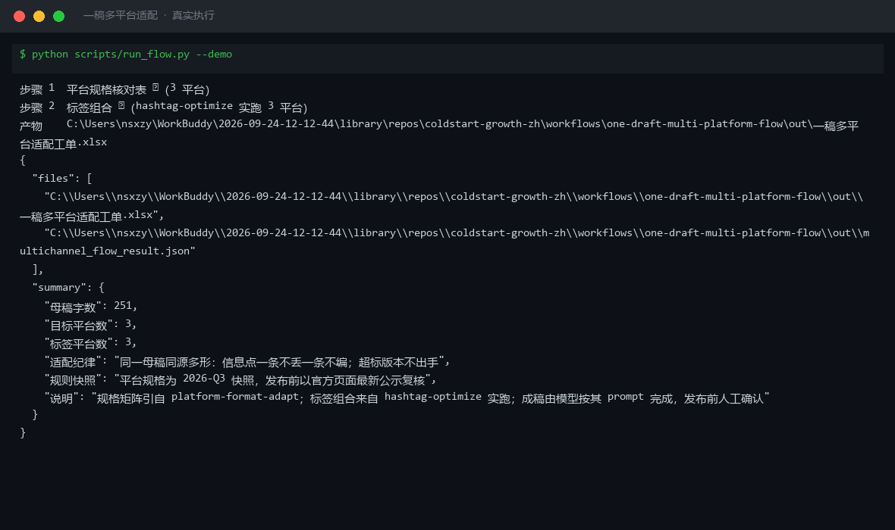
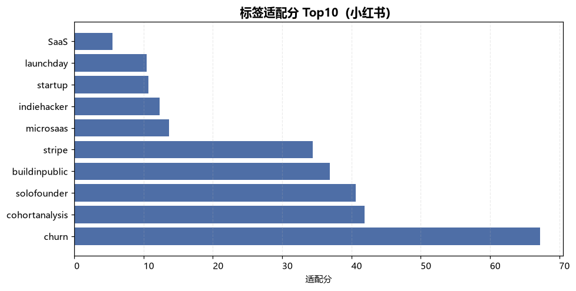
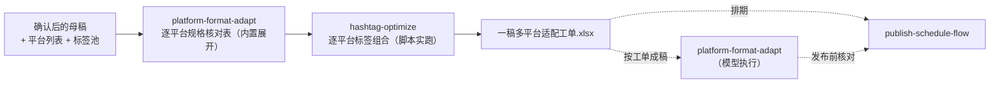

# 一稿多平台适配 One Draft Multi Platform Flow

> 复合技能（工作流）｜ 属于「出海增长官」 ｜ 冷启动期独立开发者（OPC）客群 ｜ T3 工作流（可跑编排脚本 + 流程提示词）
>
> **把一篇确认后的母稿变成「每平台一行的适配工单」：字数上限、结构、调性、自推合规、标签组合一次排好。**
> 编排 platform-format-adapt 规格矩阵（3+ 平台硬规格）+ hashtag-optimize 脚本实跑逐平台标签组合（配比随上限变化）· 产物落盘适配工单 Excel




*上图来自真实执行：母稿 251 字适配 3 平台（X/Twitter、Product Hunt、小红书），规格核对表 3 平台全过、hashtag-optimize 实跑 3 平台标签组合，产物落盘 Excel + 逐平台 tags JSON。*

---

## 它编排什么（四步链路，每步有失败处理）

| # | 步骤 | 技能资产 | 输入 → 输出 | 失败处理 |
|---|------|---------|------|---------|
| 1 | 逐平台规格核对表 | 内置（引自 [platform-format-adapt](../../skills/platform-format-adapt/) 规格矩阵） | 母稿 + 平台列表 → 每平台一行：上限/结构/调性/自推合规 | 平台未识别 → 通用规格兜底并标「需人工核对」；母稿空 → 中止 |
| 2 | 逐平台标签组合 | [hashtag-optimize](../../skills/hashtag-optimize/)（scripts/tag_score.py 实跑） | 母稿 + 标签池 → 每平台组合（随上限变化）+ 排除数 | 脚本退出码≠0 → 中止打印 stderr；tags.json 缺失 → 中止提示重跑 |
| 3 | 按工单成稿 | 模型执行 platform-format-adapt prompt | 工单 → 逐平台成稿 + 规格核对表 | 超标 → 回炉重写**不截断**；信息点丢失 → 核对不通过 |
| 4 | 进入排期 | → [publish-schedule-flow](publish-schedule-flow/) | 成稿核对结论 → 周排期表 | 自推合规为「禁止」的平台不排产品帖 |

**信息保真纪律**（引自上游）：同源多形，信息点一条不丢一条不编；数字不改写不换算；砍字按「数字>场景>功能>形容词」；**超标版本不出手**。

## 真实输入 → 真实输出

**输入**（`examples/input.json`）：251 字母稿（ChurnLens v0.9）+ 目标平台 [X/Twitter, Product Hunt, 小红书] + 标签池 12 个。

**输出**（脚本实跑，节选，完整见 [`examples/output.md`](examples/output.md)）：

| 平台 | 上限 | 结构 | 调性 | 自推合规 |
|---|---|---|---|---|
| X/Twitter | 单帖 ≤280 字符；thread ≤7 条；标签 ≤3 | 一帖一点，首帖=钩子 | 朋友报信 | 允许 |
| Product Hunt | tagline ≤60 字符；5 图 + ≤60s demo | 发布会式 + 首评自述 | 利益直给 | 允许 |
| 小红书 | 标题 ≤20 字；正文 ≤1000 字；标签 ≤10 | emoji 分段，前 2 行定完读 | 闺蜜安利 | 允许（软性） |

| 平台 | 标签组合 | 组合数 | 排除数 | 说明 |
|---|---|---|---|---|
| X/Twitter | #buildinpublic #solofounder #churn | 3 | 1 | ≤3 上限 → 大1:中1:小1 |
| Product Hunt | #buildinpublic #solofounder #stripe #churn #cohortanalysis | 5 | 1 | 5 topic → 大1:中2:小2 |
| 小红书 | 6 个标签 | 6 | 1 | ≤10 → 尽量配满（相关标签只有 6 个，如实配 6） |

排除的 1 个 = #launchday（与母稿词面零相关，tag stuffing 风险）。

**实跑产物**：



- `out/一稿多平台适配工单.xlsx`（规格工单 / 标签组合 / 信息点清单）
- `out/标签分数分布.png`（各标签适配分柱状图，上图）
- `out/tags_X_Twitter.json`、`out/tags_Product_Hunt.json`、`out/tags_小红书.json`（逐平台机器可读结果）

## 处理流水线（DAG）



## 快速开始

**提示词方式（任意 AI 工具）**

```text
1. 打开 prompt.txt，全文复制
2. 粘贴到 Coze / WorkBuddy / Dify / Claude / ChatGPT
3. 按 schema.json 的输入规格提供：母稿 + 平台列表 + 标签池
```

**脚本方式（零 AI 依赖，确定性编排）**

```bash
# 演示模式（内置真实样例）
python scripts/run_flow.py --demo
# 指定输入
python scripts/run_flow.py --input examples/input.json --outdir out
```

触发方式：事件（母稿确认后）。工单交给模型成稿，**人工确认后进入发布排期**。

## 面向谁 / 什么时候用

| ✅ 该用 | ❌ 别用 |
|---|---|
| 母稿确认后一次性铺 X / PH / 小红书等多平台 | 母稿还没确认就跑（本工作流以「确认后」为触发事件） |
| 想要标签组合随平台上限自动变化（X 3 个、小红书 10 个） | 把同一组标签复制到所有平台（超上限平台触达反降） |
| 需要信息点保真核对（一条不丢一条不编） | 字数超标硬截断（回炉重写，截掉的是钩子或数字） |

## 边界与合规

- 本工作流输出为 **AI 辅助生成内容**（工单），成稿与发布前必须**人工确认**
- 自推合规为「禁止」的平台不排产品帖；不在禁止自推的平台/sub 放产品链接
- 平台规格为 2026-Q3 快照，发布前以官方页面最新公示复核
- 上游脚本产物缺失 → 中止提示重跑，不静默跳过

## 文件地图

```text
├── README.md                  ← 本文件
├── SKILL.md                   ← 工作流定义（编排 DAG / 步骤明细 / 契约）
├── prompt.txt                 ← 流程提示词本体
├── schema.json                ← 输入输出契约（机器可读）
├── scripts/run_flow.py        ← 编排脚本（规格工单 + 调 tag_score.py）
├── examples/                  ← 真实输入 + 实跑输出
├── docs/                      ← 9 项配套文档（架构 / 流程 / 场景 / 测试报告…）
└── out/                       ← 实跑产物（一稿多平台适配工单.xlsx / 标签分数分布.png / tags_*.json）
```

---

*本资产遵循 [bangwozuo 数字员工资产规范](https://github.com/bangwozuo/digital-employee-spec) v3.0 ｜ [所属员工：出海增长官](../../) ｜ [总入口](https://github.com/bangwozuo/digital-employees-hub-zh)*
