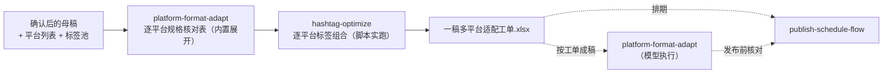

# 一稿多平台适配

把一篇确认后的母稿变成「每平台一行的适配工单」：字数上限、结构、调性、
自推合规、标签组合一次排好。工单交给模型成稿，人工确认后进入发布排期。

## 元信息

| 字段 | 值 |
|------|-----|
| ID | `de_dev_01_wf03` |
| 类型 | **`composite`（复合技能/工作流）** |
| 所属员工 | 出海增长官 |
| 阶段 | `P0` |
| 复杂度 | `S` |
| 触发方式 | 事件（母稿确认后） |
| ROI | 省 0.5h/日 ≈ ¥1200/月 |
| 资产形态 | 可跑编排脚本 + 深度流程提示词（无模型调用依赖、无 API Key） |

## 编排的原子技能

| # | 原子技能 | 能力 |
|---|---------|------|
| 1 | [平台格式适配](../../skills/platform-format-adapt/) | 逐平台规格核对表按其规格矩阵展开（T2 提示词）；成稿按其四步工作法完成 |
| 2 | [话题标签优化](../../skills/hashtag-optimize/) | 逐平台标签组合（scripts/tag_score.py 实跑，层配比随上限变化） |

## 步骤链路（DAG）



## 步骤明细

| # | 步骤 | 技能资产 | 输入 | 输出 | 失败处理 |
|---|------|---------|------|------|---------|
| 1 | 逐平台规格核对表 | 内置（引自 `platform-format-adapt` 规格矩阵） | 母稿 + 平台列表 | 每平台一行：上限/结构/调性/自推合规 | 平台未识别 → 通用规格兜底并标「需人工核对」；母稿空 → 中止 |
| 2 | 逐平台标签组合 | `hashtag-optimize`（scripts/tag_score.py） | 母稿 + 标签池 | 每平台组合（随上限变化）+ 排除数 | 脚本退出码≠0 → 中止打印 stderr；tags.json 缺失 → 中止提示重跑；标签平台之外 → 标「不用 # 标签」 |
| 3 | 按工单成稿 | （模型执行 `platform-format-adapt` prompt） | 工单 | 逐平台成稿 + 规格核对表 | 超标 → 回炉重写不截断；信息点丢失 → 核对不通过 |
| 4 | 进入排期 | → `publish-schedule-flow` | 成稿核对结论 | 周排期表 | 自推合规为「禁止」的平台不排产品帖 |

## 输入规格

| 字段 | 类型 | 必填 | 说明 |
|------|------|------|------|
| `content` | string | ✅ | 确认后的母稿（同源内容的唯一事实源） |
| `platforms` | array | ✅ | 目标平台（X/Twitter、Product Hunt、小红书、Reddit、Indie Hackers 等） |
| `tag_pool` | array | ⬜ | 候选标签快照（tag/posts_per_week/avg_engagement），供 hashtag-optimize 打分 |

## 输出规格

| 字段 | 类型 | 说明 |
|------|------|------|
| `specs` | array | 逐平台规格核对表（含自推合规硬字段与信息保真纪律） |
| `tags` | array | 逐平台标签组合（上游脚本实跑结果 + 排除数） |
| `deliverable` | file | `out/一稿多平台适配工单.xlsx`（规格工单+标签组合+汇总） |

## 错误处理

| 情况 | 处理方式 |
|------|---------|
| 上游标签脚本退出码 ≠0 | 全流程中止，打印 stderr（不静默失败） |
| tags.json 缺失/损坏 | 中止并提示重跑上游步骤 |
| 母稿/平台列表为空 | 中止并提示 |
| 平台未识别 | 通用规格兜底 + 「需人工核对官方页面」标注 |
| 标签全被排除 | 如实记录（多为语言不匹配），提示确认成稿语言后重跑 |

## 使用步骤

### 方式一：跑脚本（产出工单，标签为真实计算结果）

```bash
python3 <FLOW_DIR>/scripts/run_flow.py --input input.json --outdir out
python3 <FLOW_DIR>/scripts/run_flow.py --demo      # 无输入看效果
```

### 方式二：手动编排（任意 AI 平台）

1. 按 platform-format-adapt 的规格表逐平台列出上限/结构/调性/自推合规
2. 把 hashtag-optimize 的 prompt.txt 作为系统提示词，逐平台生成标签组合
3. 按 platform-format-adapt 四步工作法成稿并过核对表，再交 publish-schedule-flow

## 验收标准

- [x] 每步技能资产齐全且真实存在（tag_score.py 可跑）
- [x] 工单规则与上游技能 prompt 一致（规格矩阵/层配比/信息保真）
- [x] 末步产物带 AI 生成标识
- [x] 成稿与发布之间保留人工确认环节

## 边界（不做的事）

- ❌ 不编造母稿没有的数字、功能与承诺；不换算数字
- ❌ 不在自推合规为「禁止」的平台产出产品帖版本
- ❌ 不自动发布；不跳过规格核对直接成稿
- ❌ 超标版本不出手——宁可少一个平台，不发违规版本

## 调用示例

**输入**（`examples/input.json`，节选）：

```json
{
  "content": "ChurnLens v0.9 is live: Stripe sync that takes 15 minutes to set up, weekly cohort views, and plain-English churn reports — no SQL...",
  "platforms": ["X/Twitter", "Product Hunt", "小红书"],
  "tag_pool": [{"tag": "#churn", "posts_per_week": 380, "avg_engagement": 130}]
}
```

**输出**（run_flow.py 实跑，退出码 0）：3 平台规格核对表（PH 自推=允许、
含 5 图+≤60s 视频要求）；标签组合逐平台不同——X 3 个（#buildinpublic
#solofounder #churn，1:1:1）、PH 5 个、小红书 6 个。详见 examples/output.md。

## 所属工作流

上游接 `daily-topic-mine-flow`（选题）与 `devlog-to-content-flow`（成稿来源）；
下游接 `publish-schedule-flow`（把核对通过的成稿排期发布）。

## 合规声明

- 本流程产出为 **AI 辅助工单**，成稿发布由人工执行并按平台要求标注 AI 生成内容
- 自推合规逐平台硬校验；不伪装用户口吻、披露开发者身份
- 平台规格为 2026-Q3 快照，以官方最新公示为准

---

*本技能遵循 [bangwozuo 数字员工资产规范](https://github.com/bangwozuo/digital-employee-spec) v3.0*
