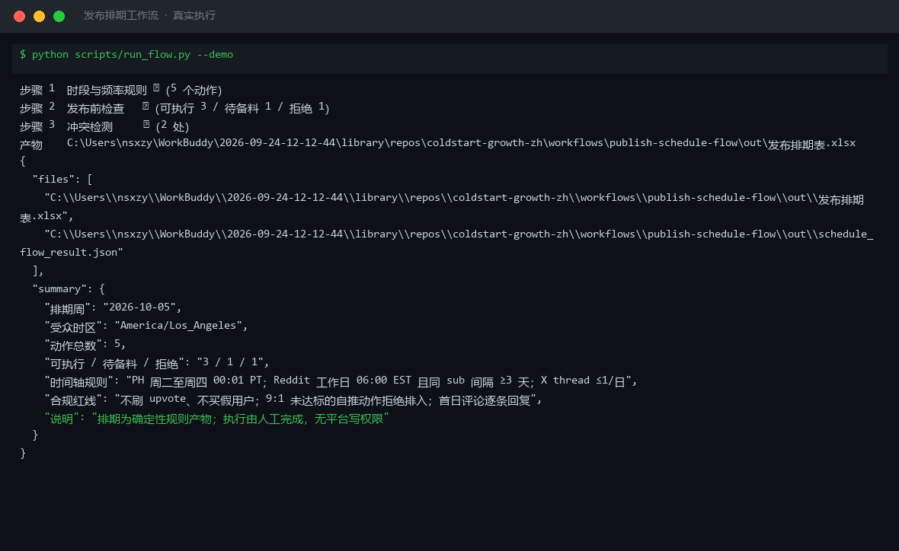
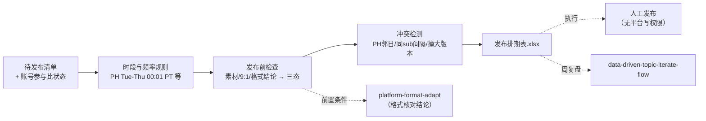

# 发布排期工作流 Publish Schedule Flow

> 复合技能（工作流）｜ 属于「出海增长官」 ｜ 冷启动期独立开发者（OPC）客群 ｜ T3 工作流（可跑编排脚本 + 流程提示词）
>
> **把待发布内容清单变成带状态机的周排期表：每个动作有日期时间、前置条件、状态与人工确认点。排期确定性生成，执行由人工完成，无平台写权限。**
> 4 平台时段频率规则（PH 周二至周四 00:01 PT / Reddit 同 sub 间隔 ≥3 天 / X thread ≤1/日）+ 三态发布前检查（✅/⏳/🛑）+ 冲突检测 · 产物落盘周排期表 Excel




🎬 **[▶ 观看高清完整版（mp4）](https://cdn.jsdelivr.net/gh/bangwozuo/coldstart-growth-zh@main/workflows/publish-schedule-flow/docs/assets/demo.mp4)** — 四幕流转叙事：业务钩子 → 真实执行 → 数据管线节点动画 → 交付物

*上图来自真实执行：2026-10-05 起 5 个动作排为「可执行 3 / 待备料 1 / 拒绝 1」，冲突检测 2 处（PH 邻日自推处理），时间轴规则与合规红线随产物落盘 Excel + JSON。*

---

## 它编排什么（三步链路，每步有失败处理）

| # | 步骤 | 技能资产 | 输入 → 输出 | 失败处理 |
|---|------|---------|------|---------|
| 1 | 时段与频率规则 | 内置（引自 [publish-schedule](../../skills/publish-schedule/) 时间轴规则） | items + week_start + 受众时区 → 每动作日期/时间 | items 空 → 中止；平台未识别 → 标「需人工核对」**不猜时段** |
| 2 | 发布前检查 → 三态 | 内置（前置条件引自 [platform-format-adapt](../../skills/platform-format-adapt/) 核对结论） | 素材状态 + 账号参与比 → ✅ 可执行 / ⏳ 待备料 / 🛑 拒绝排入 | 素材缺 → 待备料 + 截止时间**不硬排**；9:1 未达标 → 拒绝排入**不静默放行** |
| 3 | 冲突检测 | 内置 | 已排动作 → 冲突清单与处理 | PH 邻日自推 → 列处理（不贴链接不拉票）；同 sub <3 天 → 自动顺延 |

**时间轴规则**：PH 周二至周四 00:01 PT 上线抢当日榜；Reddit 工作日 06:00 EST 且同 sub 间隔 ≥3 天；X 工作日双高峰、同日 thread ≤1。

## 真实输入 → 真实输出

**输入**（`examples/input.json`）：5 条待发布动作 + 账号参与比状态（X 近 10 条自推 2 条）+ week_start=2026-10-05 + 受众时区 America/Los_Angeles。

**输出**（脚本实跑，节选，完整见 [`examples/output.md`](examples/output.md)）：

| 日期 | 时间 | 平台 | 内容 | 状态 | 人工确认点 |
|---|---|---|---|---|---|
| 10-06（周二） | 00:01 PT | Product Hunt | ChurnLens PH Launch | ⏳ 待备料（缺 demo 视频），备料截止周二 18:00 PT | 上线后首 8 小时评论值守 |
| 10-06（周二） | 06:00 EST | Reddit r/SideProject | v0.9 devlog | ✅ 可执行（9:1 达标：近 10 条自推 1） | 发布后 30 分钟首次互动检查 |
| 10-09（周四） | 06:00 EST | Reddit r/SideProject | 导出功能使用技巧 | ✅ 可执行（与上一条同 sub 间隔 3 天，自动顺延至此） | 发布前终稿 |
| （拒绝） | — | X/Twitter | v0.9 devlog thread | 🛑 拒绝排入：X 近 10 条自推 2 条 >1，先回补非自推参与 | 完成回补后下周重排 |

**冲突与处理（2 处）**：devlog / 技巧帖与 PH Launch 间隔仅 1-2 天 → Reddit 帖不放 PH 链接、不发求投票内容（刷 upvote 红线），主题错开。

**实跑产物**：`out/发布排期表.xlsx`（周排期 / 冲突 / 待备料 / 降级标注）+ `out/schedule_flow_result.json`（机器可读）。

## 处理流水线（DAG）



## 快速开始

**提示词方式（任意 AI 工具）**

```text
1. 打开 prompt.txt，全文复制
2. 粘贴到 Coze / WorkBuddy / Dify / Claude / ChatGPT
3. 按 schema.json 的输入规格提供：待发布清单 + 账号参与比 + week_start + 受众时区
```

**脚本方式（零 AI 依赖，确定性编排）**

```bash
# 演示模式（内置真实样例）
python scripts/run_flow.py --demo
# 指定输入
python scripts/run_flow.py --input examples/input.json --outdir out
```

触发方式：定时（每周日生成下周排期）+ 事件（新内容确认后）。

## 面向谁 / 什么时候用

| ✅ 该用 | ❌ 别用 |
|---|---|
| 每周生成下周排期，9:1 不达标自动拦截 | 自动执行发布（本工作流无任何平台写权限） |
| PH 发布日规划（只排周二至周四，周末流量低谷废掉发布日） | 撞大版本日排 PH（排期确认点拦截，客服与评论两头烧） |
| 待备料动作带截止时间（不硬排） | 时区排反（发布时间按目标用户时区排，不是自己的） |

## 边界与合规

- 本工作流输出为 **AI 辅助生成内容**；所有对外发布动作**由人工执行**，无平台写权限
- 🛑 拒绝排入的 9:1 未达标动作，不静默放行、不「下不为例」
- 不刷 upvote、不买假用户、不安排点赞小组——排期表不为任何刷量动作排位
- 平台时段规则为快照值，执行前人工核对平台状态（sub 版规无更新、账号无风控提示）

## 文件地图

```text
├── README.md                  ← 本文件
├── SKILL.md                   ← 工作流定义（编排 DAG / 步骤明细 / 契约）
├── prompt.txt                 ← 流程提示词本体
├── schema.json                ← 输入输出契约（机器可读）
├── scripts/run_flow.py        ← 编排脚本（时段规则 + 三态检查 + 冲突检测）
├── examples/                  ← 真实输入 + 实跑输出
├── docs/                      ← 9 项配套文档（架构 / 流程 / 场景 / 测试报告…）
└── out/                       ← 实跑产物（发布排期表.xlsx / schedule_flow_result.json）
```

---

*本资产遵循 [bangwozuo 数字员工资产规范](https://github.com/bangwozuo/digital-employee-spec) v3.0 ｜ [所属员工：出海增长官](../../) ｜ [总入口](https://github.com/bangwozuo/digital-employees-hub-zh)*
