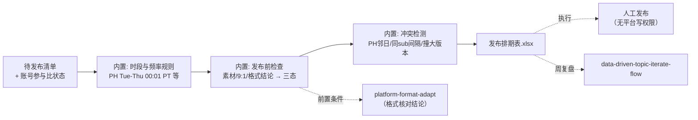

# 发布排期

把待发布内容清单变成带状态机的周排期表：每个动作有日期时间、前置条件、
状态与人工确认点。排期确定性生成，执行由人工完成，无平台写权限。

## 元信息

| 字段 | 值 |
|------|-----|
| ID | `de_dev_01_wf04` |
| 类型 | **`composite`（复合技能/工作流）** |
| 所属员工 | 出海增长官 |
| 阶段 | `P1` |
| 复杂度 | `M` |
| 触发方式 | 定时（每周日生成下周排期）+ 事件（新内容确认后） |
| ROI | 省 0.2h/日 ≈ ¥480/月 |
| 资产形态 | 可跑编排脚本 + 深度流程提示词（无模型调用依赖、无 API Key） |

## 编排的原子技能

| # | 原子技能 | 能力 |
|---|---------|------|
| 1 | [平台格式适配](../../skills/platform-format-adapt/) | 排期前置条件「格式核对结论」由其产出（T2 提示词） |
| 2 | [发布排期](../../skills/publish-schedule/) | 时段/频率/前置条件/人工确认点规则的本源（T4 SOP） |

## 步骤链路（DAG）



## 步骤明细

| # | 步骤 | 技能资产 | 输入 | 输出 | 失败处理 |
|---|------|---------|------|------|---------|
| 1 | 时段与频率规则 | 内置（引自 `publish-schedule` 时间轴规则） | items + week_start + 受众时区 | 每动作日期/时间 | items 空 → 中止；平台未识别 → 标「需人工核对」不猜时段 |
| 2 | 发布前检查 → 三态 | 内置（前置条件引自 `platform-format-adapt` 核对结论） | 素材状态 + 账号参与比 | ✅/⏳/🛑 状态 | 素材缺 → 待备料+截止时间不硬排；9:1 未达标 → 拒绝排入不静默放行 |
| 3 | 冲突检测 | 内置 | 已排动作 | 冲突清单与处理 | PH 邻日自推 → 列处理（不贴链接不拉票）；同 sub <3 天 → 自动顺延 |
| 4 | 人工执行 | （人工） | 排期表 | 发布完成标记 | 首日评论值守（PH 上线后 8 小时）为确认点，不是可选项 |

## 输入规格

| 字段 | 类型 | 必填 | 说明 |
|------|------|------|------|
| `week_start` | string | ✅ | 排期周起始日（ISO 日期，周一） |
| `audience_tz` | string | ⬜ | 目标受众时区（默认 America/Los_Angeles） |
| `account_state` | object | ⬜ | 账号参与比：`reddit_last_10_selfpromo` / `x_last_10_selfpromo` |
| `items` | array | ✅ | 待发布条目：title / platforms（支持 `Reddit:r/xxx`）/ selfpromo / material_ready / missing |

## 输出规格

| 字段 | 类型 | 说明 |
|------|------|------|
| `schedule` | array | 周排期表（日期/时间/平台/内容/前置条件/状态/标记/确认点） |
| `conflicts` | array | 冲突与处理 |
| `deliverable` | file | `out/发布排期表.xlsx`（周排期表+冲突+汇总；🛑/⏳ 行条件格式标红） |

## 错误处理

| 情况 | 处理方式 |
|------|---------|
| items 为空 | 流程中止并提示 |
| 9:1 未达标 | 该自推动作「🛑 拒绝排入」，其余照常（不静默放行） |
| 素材未齐 | 「⏳ 待备料」+ 备料截止时间，不硬排 |
| 同 sub 间隔 <3 天 | 排期器自动顺延到下一个满足间隔的工作日 |
| 平台未识别 | 状态「需人工核对时段规则」，不猜 |

## 使用步骤

### 方式一：跑脚本（确定性排期，真实 Excel）

```bash
python3 <FLOW_DIR>/scripts/run_flow.py --input input.json --outdir out
python3 <FLOW_DIR>/scripts/run_flow.py --demo      # 无输入看效果
```

### 方式二：手动编排（任意 AI 平台）

1. 把 publish-schedule 的 prompt.txt 作为系统提示词，提供待发布清单与账号状态
2. 按其时间轴规则逐动作核对三态与冲突
3. 周日生成下周排期 → 排期确认（人工）→ 逐动作发布前/后确认

## 验收标准

- [x] 每步技能资产齐全且真实存在（publish-schedule T4 + platform-format-adapt T2）
- [x] 排期规则与 publish-schedule prompt 完全一致
- [x] 末步产物带 AI 生成标识
- [x] 全流程无平台写权限，执行由人工完成

## 边界（不做的事）

- ❌ 不自动执行任何发布；不为刷量动作排位
- ❌ 9:1 未达标不排自推；素材不齐不硬排
- ❌ 不按自己的时区排期；不猜未识别平台的时段规则

## 调用示例

**输入**（`examples/input.json`，节选）：

```json
{
  "week_start": "2026-10-05",
  "account_state": {"reddit_last_10_selfpromo": 1, "x_last_10_selfpromo": 2},
  "items": [
    {"title": "ChurnLens PH Launch", "platforms": ["Product Hunt"], "selfpromo": true, "material_ready": false, "missing": "demo 视频（≤60 秒）"},
    {"title": "v0.9 devlog", "platforms": ["Reddit:r/SideProject", "X/Twitter"], "selfpromo": true, "material_ready": true}
  ]
}
```

**输出**（run_flow.py 实跑，退出码 0）：5 动作 → 可执行 3 / 待备料 1 /
拒绝 1；PH 排周三 00:01 PT（待备料）、Reddit 两次发帖自动顺延到间隔 ≥3 天
（周二/周四）、X 自推因近 10 条自推 2 条被拒绝排入；PH 邻日冲突 2 处带处理。
详见 examples/output.md。

## 所属工作流

上游接 `one-draft-multi-platform-flow`（格式核对结论作为前置条件）；
周末接 `data-driven-topic-iterate-flow`（复盘本周各动作表现）。

## 合规声明

- 本流程产出为 **AI 辅助排期表**，发布由人工执行并按平台要求标注 AI 生成内容
- 合规红线内建于排期规则：9:1 守门、不刷 upvote、不为刷量排位、身份披露
- 无平台写权限；连接器（Plausible/Reddit/X API）均为只读且带降级路径

---

*本技能遵循 [bangwozuo 数字员工资产规范](https://github.com/bangwozuo/digital-employee-spec) v3.0*
